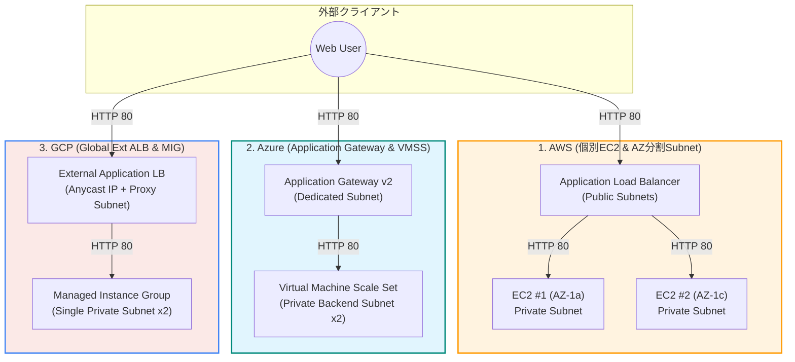

# クラウドアーキテクチャ検証 LEVEL2（マルチクラウド IaC ライフサイクル統合）

<p align="center">
  <b>AWS / Azure / GCP 3大クラウドにおける AI 主導 Terraform ライフサイクル検証の統合リポジトリ</b>
</p>

<p align="center">
  <a href="docs/final-report.md"><b>📊 3社横断・最終比較レポート</b></a> │
  <a href="aws/"><b>🟧 AWS 検証環境</b></a> │
  <a href="azure/"><b>🟦 Azure 検証環境</b></a> │
  <a href="gcp/"><b>🟥 GCP 検証環境</b></a> │
  <a href="https://github.com/moruku36/cloud-validation-level3-astra-light"><b>🚀 次段階: LEVEL3 検証</b></a>
</p>

---

## 1. プロジェクト概要

本リポジトリは、**「AI / Codex にどこまでパブリッククラウドのインフラ実装・運用ライフサイクルを任せられるか」** を検証した、AWS・Azure・GCP 3環境の成果物を1つに統合したリポジトリです。

- **位置づけ (LEVEL2)**: 最小構成のWeb基盤（L7 LB + Private VM 2台）を対象に、BootstrapからCI/CD、監視、カオス試験、完全破棄（Clean Destroy）までを実機上で実証。
- **次工程 (LEVEL3)**: 本検証の知見を踏まえ、より高度で曖昧なビジネス要件から自律型AIが設計・評価する [cloud-validation-level3-astra-light](https://github.com/moruku36/cloud-validation-level3-astra-light) へと発展しています。

---

## 2. 3大クラウド アーキテクチャ比較

各クラウドとも「インターネットから直接VMへSSH/接続させず、L7ロードバランサー配下のPrivate VM 2台でHTTP 200を応答する」同一の可用性・セキュリティ要件を満たす最小構成を採用しています。



---

## 3. 検証ライフサイクルフロー

全クラウド共通で、以下の7フェーズをAI主導（人間は承認・安全境界の維持）で完遂しました。

```mermaid
flowchart LR
    P1["Phase 1: Bootstrap<br/>(Storage & OIDC)"] --> P2["Phase 2: Core Infra<br/>(Network, LB, Compute)"]
    P2 --> P3["Phase 3: State Migration<br/>(Remote Lock)"]
    P3 --> P4["Phase 4: CI/CD Pipeline<br/>(GitHub OIDC)"]
    P4 --> P5["Phase 5: Monitoring<br/>(HealthCheck & Alarm)"]
    P5 --> P6["Phase 6: Chaos Test<br/>(Instance Kill & Recovery)"]
    P6 --> P7["Phase 7: Clean Destroy<br/>(Target Res: 0)"]

    style P1 fill:#E8EAF6,stroke:#3F51B5
    style P2 fill:#E8EAF6,stroke:#3F51B5
    style P3 fill:#E8EAF6,stroke:#3F51B5
    style P4 fill:#E8EAF6,stroke:#3F51B5
    style P5 fill:#FFF8E1,stroke:#FFA000
    style P6 fill:#FFEBEE,stroke:#E53935
    style P7 fill:#E8F5E9,stroke:#43A047
```



---

## 4. 3社横断 比較サマリー

| 項目 | 🟧 AWS | 🟦 Azure | 🟥 GCP |
|---|---|---|---|
| **ロードバランサー** | Application Load Balancer (ALB) | Application Gateway v2 (Standard_v2) | External Application Load Balancer (Global) |
| **コンピュート** | EC2 単体 x 2（AZ別配置） | VM Scale Set (Flexible, 2インスタンス) | Managed Instance Group (Regional, 2インスタンス) |
| **踏み台 / 接続** | なし（ユーザーデータによるWeb起動） | なし（cloud-initによるWeb起動） | なし（startup-scriptによるWeb起動） |
| **CI/CD 認証** | IAM OpenID Connect (OIDC) Role | Microsoft Entra Workload Identity | Workload Identity Federation (WIF) |
| **Remote State** | S3 Bucket + S3 Native Lockfile | Blob Storage + Lease Lock | Google Cloud Storage (Object Lock) |
| **監視** | CloudWatch Alarm (UnhealthyHostCount) + ALB Access Log | Application Gateway UnhealthyHostCount + Alert | Uptime Check + Metric Alert (Active Instances) |
| **カオス試験** | 1台停止時の縮退・発報・復旧確認 | 1台削除時の自動再起動・アラート確認 | 1台強制削除時のMIG自己修復・回復確認 |
| **Clean Destroy** | 39リソース削除、残存 0 | 全リソースグループ削除、残存 0 | 全リソース削除、残存 0 |

---

## 5. ディレクトリ構成

```text
cloud-validation-level2-multicloud/
├── README.md                          # 本ファイル（全体統合サマリー・ダイアグラム）
├── docs/                              # 技術ドキュメント
│   ├── final-report.md                # 3社横断詳細比較・最終レポート
│   ├── aws/                           # AWS固有ドキュメント (01〜09)
│   ├── azure/                         # Azure固有ドキュメント (01〜08)
│   └── gcp/                           # GCP固有ドキュメント (01〜08)
├── aws/                               # AWS Terraform コード & Bootstrap
│   ├── README.md                      # AWS個別ガイド
│   ├── bootstrap/                     # OIDC / S3 State 初期化用 HCL
│   ├── scripts/                       # 障害注入・検証スクリプト
│   └── *.tf                           # VPC, ALB, EC2, CloudWatch定義
├── azure/                             # Azure Terraform コード & Bootstrap
│   ├── README.md                      # Azure個別ガイド
│   ├── bootstrap/                     # OIDC / Storage Account 初期化用 HCL
│   └── *.tf                           # VNet, AppGW, VMSS, Monitor定義
└── gcp/                               # GCP Terraform コード & Bootstrap
    ├── README.md                      # GCP個別ガイド
    ├── bootstrap/                     # WIF / GCS State 初期化用 HCL
    └── *.tf                           # VPC, GCLB, MIG, Alert定義
```

---

## 6. 各クラウドの詳細ドキュメントへのリンク

### 🟧 AWS
- [AWS シナリオ](docs/aws/01-scenario.md) │ [アーキテクチャ](docs/aws/02-architecture.md) │ [実装手順](docs/aws/03-implementation.md)
- [トラブルシューティング](docs/aws/04-troubleshooting.md) │ [検証結果](docs/aws/05-results.md) │ [学び・考察](docs/aws/06-lessons-learned.md)
- [CI/CD & OIDC](docs/aws/07-cicd-oidc-remote-state.md) │ [監視設計](docs/aws/08-monitoring.md) │ [クリーンアップ](docs/aws/09-final-results-and-cleanup.md)

### 🟦 Azure
- [Azure シナリオ](docs/azure/01-scenario.md) │ [アーキテクチャ](docs/azure/02-architecture.md) │ [実装手順](docs/azure/03-implementation.md)
- [トラブルシューティング](docs/azure/04-troubleshooting.md) │ [検証結果](docs/azure/05-results.md) │ [学び・考察](docs/azure/06-lessons-learned.md)
- [CI/CD & OIDC](docs/azure/07-cicd-oidc-remote-state.md) │ [監視設計](docs/azure/08-monitoring.md)

### 🟥 GCP
- [GCP シナリオ](docs/gcp/01-scenario.md) │ [アーキテクチャ](docs/gcp/02-architecture.md) │ [実装手順](docs/gcp/03-implementation.md)
- [トラブルシューティング](docs/gcp/04-troubleshooting.md) │ [検証結果](docs/gcp/05-results.md) │ [学び・考察](docs/gcp/06-lessons-learned.md)
- [CI/CD & WIF](docs/gcp/07-cicd-oidc-remote-state.md) │ [監視設計](docs/gcp/08-monitoring.md)

---

## 7. 関連リポジトリ

- **次段階 LEVEL3**: [cloud-validation-level3-astra-light](https://github.com/moruku36/cloud-validation-level3-astra-light)
  - 曖昧なビジネス要件から自律型AI（GPT-6 Astra Light）がアーキテクチャ選定・コスト見積・ペーパー評価を実施。