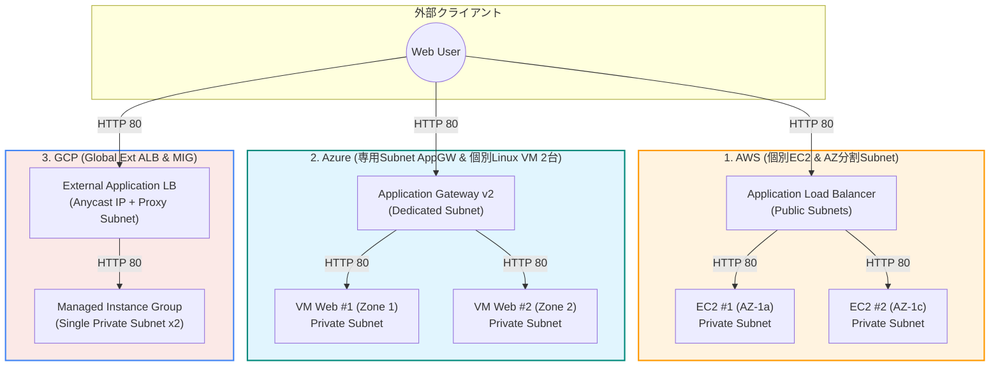

# クラウドアーキテクチャ検証 LEVEL2（マルチクラウド IaC ライフサイクル統合）
### Consolidated Level 2 Multi-Cloud Terraform Validation (AWS / Azure / GCP)

<p align="center">
  <b>AWS / Azure / GCP 3大クラウドにおける AI 主導 Terraform ライフサイクル検証の統合リポジトリ</b><br/>
  <i>Consolidated repository evaluating autonomous AI-driven Terraform lifecycles across AWS, Azure, and Google Cloud.</i>
</p>

<p align="center">
  <a href="docs/final-report.md"><b>📊 3社横断・最終比較レポート (Final Report)</b></a> │
  <a href="aws/"><b>🟧 AWS</b></a> │
  <a href="azure/"><b>🟦 Azure</b></a> │
  <a href="gcp/"><b>🟥 GCP</b></a> │
  <a href="https://github.com/moruku36/cloud-validation-level3-astra-light"><b>🚀 次段階: LEVEL3 検証</b></a>
</p>

---

## English Summary

> **Objective & Scope**:  
> This repository consolidates three independent validations assessing how autonomously AI (Codex) can design, provision, configure, test, and safely destroy production-grade cloud infrastructure via Terraform across **AWS**, **Azure**, and **GCP**.  
>  
> **Key Achievements (Level 2 Baseline)**:
> - **Unified Spec**: High-availability web infrastructure (L7 Load Balancer + 2 Private VMs without direct public SSH) across multi-AZ/subnets.
> - **End-to-End Lifecycle**: Automated bootstrapping (OIDC / Keyless Federation, Remote State), CI/CD pipelines (GitHub Actions), health monitoring, chaos injection (instance termination & failover), and clean destruction (0 lingering resources).
> - **Progression to Level 3**: Findings from this Level 2 baseline directly led to [cloud-validation-level3-astra-light](https://github.com/moruku36/cloud-validation-level3-astra-light), where autonomous agents tackle ambiguous enterprise requirements and multi-cloud architectural evaluations.

---

## 1. プロジェクト概要 (Japanese)

> [!IMPORTANT]
> **本リポジトリのステータスと利用方針**:  
> 検証環境の実リソースはすべて Clean Destroy 済み（残存 0）です。本リポジトリは「検証記録・比較分析レポート」と「再現用 Terraform / CI 定義」を兼ねています。  
> クローン後に実環境へ `apply` する場合は、各クラウドの `bootstrap/` による OIDC / Remote State の事前プロビジョニングと、GitHub Repository Variables / Secrets の再設定が必要です。

本リポジトリは、**「AI / Codex にどこまでパブリッククラウドのインフラ実装・運用ライフサイクルを任せられるか」** を検証した、AWS・Azure・GCP 3環境の成果物を1つに統合したリポジトリです。

- **位置づけ (LEVEL2)**: 最小構成のWeb基盤（L7 LB + Private VM 2台）を対象に、BootstrapからCI/CD、監視、カオス試験、完全破棄（Clean Destroy）までを実機上で実証（※「LEVEL2」は本検証における検証範囲を示す便宜的呼称であり、業界標準規格ではありません）。
- **使用AI環境**: OpenAI Codex / Google DeepMind Antigravity などの自律型AIエージェントによる検証。
- **次工程 (LEVEL3)**: 本検証の知見を踏まえ、より高度で曖昧なビジネス要件から自律型AIが設計・評価する [cloud-validation-level3-astra-light](https://github.com/moruku36/cloud-validation-level3-astra-light) へと発展しています。

---

## 2. 3大クラウド アーキテクチャ比較

各クラウドとも「インターネットから直接VMへSSH/接続させず、L7ロードバランサー配下のPrivate VM 2台でHTTP 200を応答する」同一の可用性・セキュリティ要件を満たす最小構成を採用しています。



---

## 3. 検証ライフサイクルフロー

全クラウド共通で、以下の7フェーズをAI主導（人間は承認・安全境界の維持）で完遂しました。

```mermaid
flowchart LR
    P1["Phase 1: Bootstrap<br/>(Storage & OIDC)"] --> P2["Phase 2: Core Infra<br/>(Network, LB, Compute)"]
    P2 --> P3["Phase 3: State Migration<br/>(Remote Lock)"]
    P3 --> P4["Phase 4: CI/CD Pipeline<br/>(GitHub OIDC)"]
    P4 --> P5["Phase 5: Monitoring<br/>(HealthCheck & Alarm)"]
    P5 --> P6["Phase 6: Chaos Test<br/>(Instance Kill & Recovery)"]
    P6 --> P7["Phase 7: Clean Destroy<br/>(Target Res: 0)"]

    style P1 fill:#E8EAF6,stroke:#3F51B5
    style P2 fill:#E8EAF6,stroke:#3F51B5
    style P3 fill:#E8EAF6,stroke:#3F51B5
    style P4 fill:#E8EAF6,stroke:#3F51B5
    style P5 fill:#FFF8E1,stroke:#FFA000
    style P6 fill:#FFEBEE,stroke:#E53935
    style P7 fill:#E8F5E9,stroke:#43A047
```



---

## 4. 3社横断 比較サマリー

| 項目 | 🟧 AWS | 🟦 Azure | 🟥 GCP |
|---|---|---|---|
| **ロードバランサー** | Application Load Balancer (ALB) | Application Gateway v2 (Standard_v2) | External Application Load Balancer (Global) |
| **コンピュート** | EC2 単体 x 2（AZ別配置） | Zone指定 Linux VM 2台（Zone 1 / 2） | Managed Instance Group (Regional, 2インスタンス) |
| **踏み台 / 接続** | なし（ユーザーデータによるWeb起動） | なし（cloud-initによるWeb起動） | なし（startup-scriptによるWeb起動） |
| **CI/CD 認証** | IAM OpenID Connect (OIDC) Role（単一Role） | Microsoft Entra Workload Identity（PR / Apply 分離） | Workload Identity Federation（PR / Apply SA 分離） |
| **Remote State** | S3 Bucket + S3 Native Lockfile | Blob Storage + Lease Lock | Google Cloud Storage (Object Lock) |
| **監視** | CloudWatch Alarm (UnhealthyHostCount) + ALB Access Log | Application Gateway UnhealthyHostCount + Alert | Uptime Check + Metric Alert (Active Instances) |
| **カオス試験** | 1台停止時の縮退・発報・復旧確認 | 1台 deallocate（停止）時の検知・HTTP 200維持・復旧確認 | MIG target size縮小（2→1→2台）時の縮退・自己修復確認 |
| **Clean Destroy** | 39リソース削除、残存 0 | 全リソースグループ削除、残存 0 | 全リソース削除、残存 0 |

---

## 5. ディレクトリ構成

```text
cloud-validation-level2-multicloud/
├── .github/workflows/                 # モノレポ用 CI/CD (paths フィルター付き)
│   ├── aws-pr.yml / aws-apply.yml
│   ├── azure-pr.yml / azure-apply.yml
│   └── gcp-pr.yml / gcp-apply.yml
├── scripts/                           # 統合運用スクリプト
│   └── validate-all.ps1               # 3社一括フォーマット・バリデーションスクリプト
├── LICENSE                            # MIT License
├── README.md                          # 本ファイル（全体統合サマリー・ダイアグラム）
├── docs/                              # 技術ドキュメント
│   ├── final-report.md                # 3社横断詳細比較・最終レポート
│   ├── aws/                           # AWS固有ドキュメント (01〜09, handoff)
│   ├── azure/                         # Azure固有ドキュメント (01〜08)
│   └── gcp/                           # GCP固有ドキュメント (01〜08)
├── aws/                               # AWS Terraform コード & Bootstrap
│   ├── README.md                      # AWS個別ガイド（再現手順含む）
│   ├── bootstrap/                     # OIDC / S3 State 初期化用 HCL
│   ├── scripts/                       # S3 State 移行用スクリプト
│   └── *.tf                           # VPC, ALB, EC2, CloudWatch定義
├── azure/                             # Azure Terraform コード & Bootstrap
│   ├── README.md                      # Azure個別ガイド（再現手順含む）
│   ├── bootstrap/                     # OIDC / Storage Account 初期化用 HCL
│   └── *.tf                           # VNet, AppGW, Linux VM, Monitor定義
└── gcp/                               # GCP Terraform コード & Bootstrap
    ├── README.md                      # GCP個別ガイド（再現手順含む）
    ├── bootstrap/                     # WIF / GCS State 初期化用 HCL
    └── *.tf                           # VPC, GCLB, MIG, Alert定義
```

---

## 6. 前提条件と必要環境

本リポジトリのコードをローカルおよび CI/CD で実行・再現するための要件です。

| ツール / CLI | 推奨バージョン | 備考 |
|---|---|---|
| **Terraform** | `>= 1.10.0, < 2.0.0` | S3 native lockfile (`use_lockfile = true`) をサポートするため 1.10+ が必須 |
| **AWS CLI** | `v2.x` | `aws sts get-caller-identity` 等の確認用 |
| **Azure CLI** | `azure-cli 2.60+` | `az account show` 等の確認用 |
| **Google Cloud CLI** | `Google Cloud SDK 480.0+` | `gcloud auth application-default login` 用 |
| **PowerShell** | `7.x (pwsh)` / `5.1` | `validate-all.ps1` や `migrate-state.ps1` の実行環境 |

---

## 7. GitHub Actions 認証・Variables/Secrets 一覧

CI/CD パイプラインを稼働させる場合、GitHub リポジトリの Variables および Secrets に以下の登録が必要です。

| クラウド | 名前 | 種別 | 設定場所 | 説明 |
|---|---|---|---|---|
| **共通** | `AWS_ENVIRONMENT_ACTIVE` | Variable | Repository | `true` の場合のみ AWS cloud plan/apply を実行 |
| **共通** | `AZURE_ENVIRONMENT_ACTIVE` | Variable | Repository | `true` の場合のみ Azure cloud plan/apply を実行 |
| **共通** | `GCP_ENVIRONMENT_ACTIVE` | Variable | Repository | `true` の場合のみ GCP cloud plan/apply を実行 |
| **AWS** | `AWS_REGION` | Variable | Repository | AWS デプロイ先リージョン (例: `ap-northeast-1`) |
| **AWS** | `AWS_TERRAFORM_ROLE_ARN` | Variable | Repository | GitHub OIDC で Assume する IAM Role ARN |
| **AWS** | `TF_STATE_BUCKET` | Variable | Repository | Terraform S3 State バケット名 |
| **AWS** | `TF_STATE_KEY` | Variable | Repository | S3 State オブジェクトキー (例: `terraform/aws-validation.tfstate`) |
| **Azure** | `AZURE_SUBSCRIPTION_ID` | Secret | Repository | Azure サブスクリプション ID |
| **Azure** | `AZURE_TENANT_ID` | Secret | Repository | Microsoft Entra テナント ID |
| **Azure** | `AZURE_PR_CLIENT_ID` | Secret | Repository | PR 用 Managed Identity の Client ID (Reader) |
| **Azure** | `AZURE_APPLY_CLIENT_ID` | Secret | Environment (`terraform-production`) | Apply 用 Managed Identity の Client ID (Contributor) |
| **Azure** | `TF_STATE_RESOURCE_GROUP` | Variable | Repository | State 用 Storage Account の Resource Group 名 |
| **Azure** | `TF_STATE_STORAGE_ACCOUNT` | Variable | Repository | State 用 Storage Account 名 |
| **Azure** | `TF_STATE_CONTAINER` | Variable | Repository | State 用 Blob Container 名 |
| **Azure** | `TF_STATE_KEY` | Variable | Repository | State Blob キー (例: `terraform/azure-validation.tfstate`) |
| **GCP** | `GCP_PROJECT_ID` | Secret | Repository | 対象 Google Cloud プロジェクト ID |
| **GCP** | `GCP_WIF_PROVIDER` | Secret | Repository | WIF Provider リソース名 (`projects/.../locations/global/workloadIdentityPools/.../providers/...`) |
| **GCP** | `GCP_PR_SA_EMAIL` | Secret | Repository | PR 用 Service Account Email (Viewer / State Reader) |
| **GCP** | `GCP_APPLY_SA_EMAIL` | Secret | Environment (`terraform-production`) | Apply 用 Service Account Email (Editor / State Admin) |
| **GCP** | `GCP_STATE_BUCKET` | Secret | Repository | State 用 GCS バケット名 |
| **GCP** | `GCP_STATE_PREFIX` | Secret | Repository | State GCS プレフィックス (例: `terraform/root`) |

---

## 8. ローカル検証・一括チェック

ルートから以下のコマンドで全クラウド（および bootstrap）の構文・バリデーションを一括実行できます：

```powershell
# 全環境の terraform fmt & validate を一括実行
./scripts/validate-all.ps1
```

---

## 9. 各クラウドの詳細ドキュメントへのリンク

### 🟧 AWS
- [AWS シナリオ](docs/aws/01-scenario.md) │ [アーキテクチャ](docs/aws/02-architecture.md) │ [実装手順](docs/aws/03-implementation.md)
- [トラブルシューティング](docs/aws/04-troubleshooting.md) │ [検証結果](docs/aws/05-results.md) │ [学び・考察](docs/aws/06-lessons-learned.md)
- [CI/CD & OIDC](docs/aws/07-cicd-oidc-remote-state.md) │ [監視設計](docs/aws/08-monitoring.md) │ [引継ぎ](docs/aws/handoff-antigravity.md) │ [クリーンアップ](docs/aws/09-final-results-and-cleanup.md)

### 🟦 Azure
- [Azure シナリオ](docs/azure/01-scenario.md) │ [アーキテクチャ](docs/azure/02-architecture.md) │ [実装手順](docs/azure/03-implementation.md)
- [トラブルシューティング](docs/azure/04-troubleshooting.md) │ [検証結果](docs/azure/05-results.md) │ [学び・考察](docs/azure/06-lessons-learned.md)
- [CI/CD & OIDC](docs/azure/07-cicd-oidc-remote-state.md) │ [監視設計](docs/azure/08-monitoring.md)

### 🟥 GCP
- [GCP シナリオ](docs/gcp/01-scenario.md) │ [アーキテクチャ](docs/gcp/02-architecture.md) │ [実装手順](docs/gcp/03-implementation.md)
- [トラブルシューティング](docs/gcp/04-troubleshooting.md) │ [検証結果](docs/gcp/05-results.md) │ [学び・考察](docs/gcp/06-lessons-learned.md)
- [CI/CD & WIF](docs/gcp/07-cicd-oidc-remote-state.md) │ [監視設計](docs/gcp/08-monitoring.md)

---

## 10. 関連リポジトリ

- **次段階 LEVEL3**: [cloud-validation-level3-astra-light](https://github.com/moruku36/cloud-validation-level3-astra-light)
  - 曖昧なビジネス要件から自律型AI（GPT-6 Astra Light）がアーキテクチャ選定・コスト見積・ペーパー評価を実施。