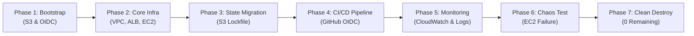
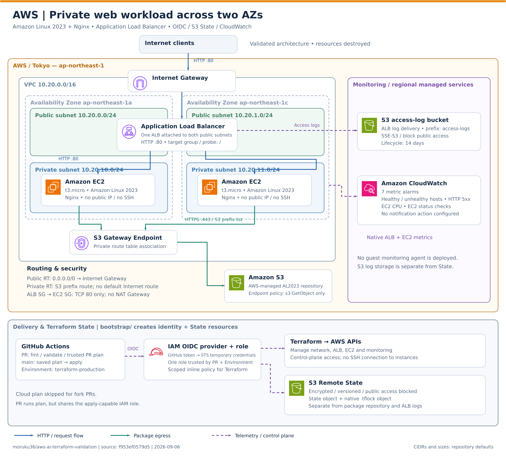
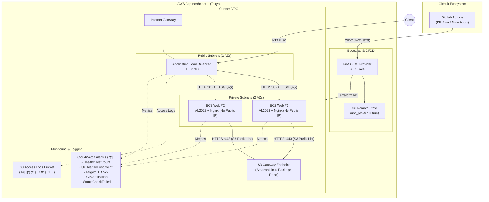

# AWS + Terraform 検証環境

**[AWS / Azure / GCP 横断・最終比較レポート](../docs/final-report.md)** — 実行結果、AIの失敗と復旧、人間の責任、再現性レビュー。

## 検証目的

AI/Codex にどこまでAWSインフラ実装を任せられるかを検証した、最小構成かつ破棄可能なTerraform環境です。構築、障害修正、CI/CD、OIDC、Remote State、監視、障害試験、最終削除までの一連の検証を完了しています。

## 現在の進捗

- AWS東京リージョンにVPC、Public / Private Subnet各2つ、ALB、Private EC2 2台を構築し、ALB経由のHTTP 200を確認
- GitHub Actions、OIDC一時Credential、S3 Remote State、S3 native lockfileによるCI/CDを実証
- CloudWatchアラームとALBアクセスログを追加し、サービスを維持したバックエンド障害試験で発報・復旧を確認
- 最終destroyは事前planの39削除・置換なしを確認後に実行
- Root、bootstrap、Remote State、OIDC Provider、IAM Role、一時IAM policyを削除し、対象リソースの残存なしを確認

> このリポジトリには認証情報、Terraform state、実環境のリソースIDやIPアドレスを含めません。現在、検証用AWS環境は削除済みです。

## 検証ライフサイクルフロー



## アーキテクチャ構成図





構成要素と設計判断の詳細は[アーキテクチャ](../docs/aws/02-architecture.md)を参照してください。

## 最終結果サマリー

### 定量評価指標

| 評価指標 | 実績値 / 状況 | ビジュアル指標 |
|---|---|---|
| **総合評価スコア** | **93 / 100** | `█████████░ 93%` |
| **HTTP 200 可用性** | 障害試験中も停止なし | `██████████ 100%` |
| **Root リソース完全削除** | 39 / 39 削除完了 | `██████████ 100%` |
| **Bootstrap 完全削除** | 9 / 9 削除完了 | `██████████ 100%` |
| **環境残存リソース** | 0 件 | `░░░░░░░░░░ 0 件` |

### 検証項目別ステータス

| 項目 | 結果 |
| --- | --- |
| Terraform構築 | 成功。Private EC2 2台、ALB、S3 Endpointを含む構成を再現可能なコードとして管理 |
| CI/CD | PRのread-only planと、Environment保護下のmain applyに成功 |
| AWS認証 | 長期Access KeyをGitHubへ保存せず、OIDC一時Credentialを使用 |
| State | S3 Remote Stateと`use_lockfile = true`を使用し、移行後`No changes`を確認 |
| 監視 | CloudWatchアラーム7件とALBアクセスログを実装 |
| 障害試験 | 通常サービスのHTTP 200を維持しながらバックエンド異常の発報・復旧を確認 |
| 推定コスト | 検証期間の関連サービス合計で約0.25 USD（タグ別実績ではない概算） |
| Cleanup | Root 39リソース、bootstrap 9リソース、State全version、一時IAM policyを削除。対象残存なし |

人間介入は意味のある操作単位で8カテゴリ、AIは設計、実装、診断、CI/CD操作、障害試験、復旧、削除、残存確認を自律実行しました。最終評価は **93 / 100** です。集計基準、全障害、減点理由は[最終結果とCleanup](../docs/aws/09-final-results-and-cleanup.md)に記録しています。

## 再現手順

前提: Terraform `>= 1.8.0, < 2.0.0`、AWS認証済みのローカル環境、対象リソースを作成できる最小権限。現在はbootstrapを含めて削除済みのため、再検証時は`bootstrap/`でState BucketとOIDC Roleを先に作成し、`backend.tf.example`を基にbackend設定を作成してからRootを適用します。

```powershell
Copy-Item bootstrap/terraform.tfvars.example bootstrap/terraform.tfvars
# bootstrap/terraform.tfvarsの識別子を設定して内容を確認する
terraform -chdir=bootstrap init
terraform -chdir=bootstrap plan -out=tfplan
terraform -chdir=bootstrap apply tfplan

Copy-Item terraform.tfvars.example terraform.tfvars
Copy-Item backend.tf.example backend.tf
terraform init
terraform fmt -check
terraform validate
terraform plan -out tfplan
# planを確認してから実行する
terraform apply tfplan
terraform output -raw alb_url
```

検証終了後は、課金を止めるために必ず削除します。

```powershell
terraform destroy
```

## ドキュメント

- [検証シナリオ](../docs/aws/01-scenario.md)
- [アーキテクチャ](../docs/aws/02-architecture.md)
- [実装内容](../docs/aws/03-implementation.md)
- [トラブルシューティング](../docs/aws/04-troubleshooting.md)
- [検証結果](../docs/aws/05-results.md)
- [学びと次の段階](../docs/aws/06-lessons-learned.md)
- [CI/CD・OIDC・Remote State](../docs/aws/07-cicd-oidc-remote-state.md)
- [監視設計・実装状況](../docs/aws/08-monitoring.md)
- [Antigravity向け引継ぎ](../docs/aws/08-antigravity-handoff.md)
- [最終結果・スコア・Cleanup](../docs/aws/09-final-results-and-cleanup.md)
