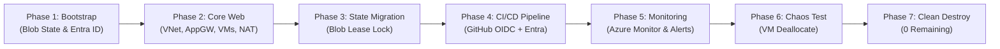
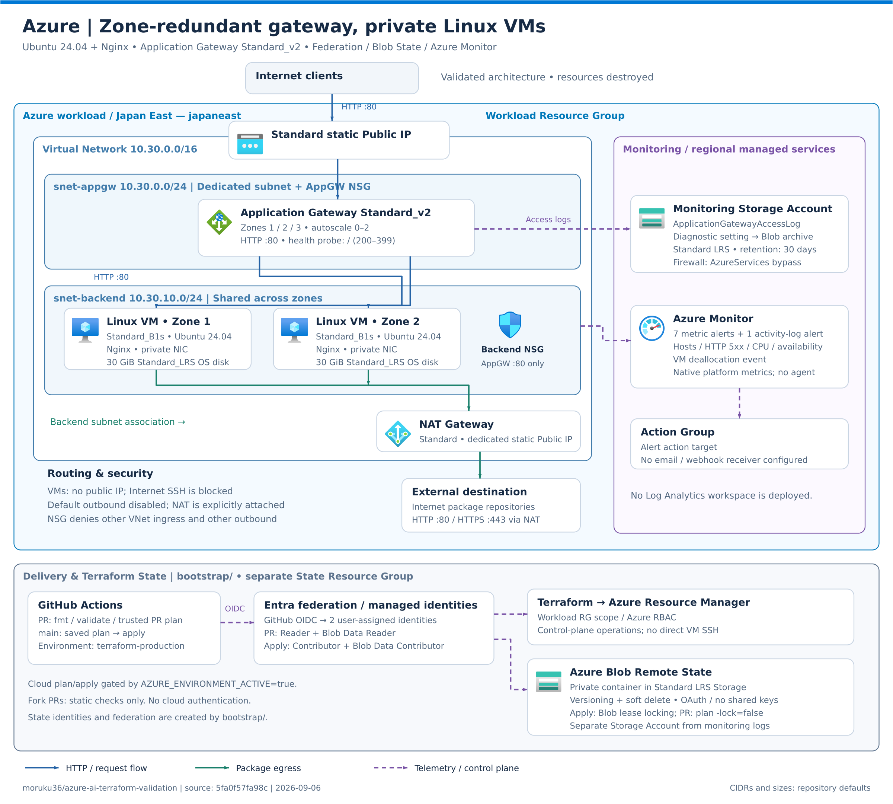
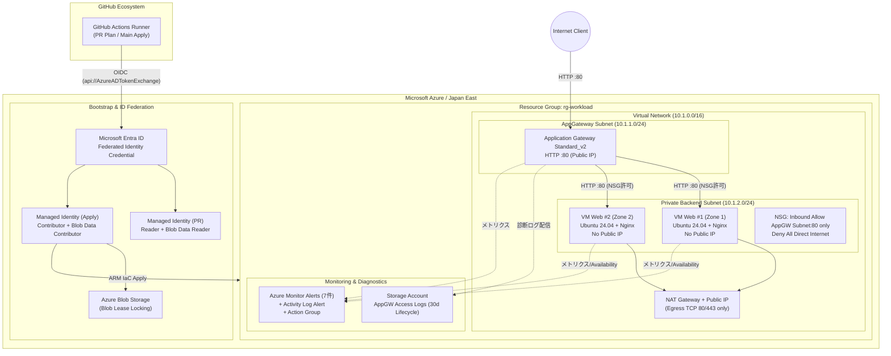

# Azure AI Terraform Validation

**[AWS / Azure / GCP 横断・最終比較レポート](../docs/final-report.md)** — 実行結果、AIの失敗と復旧、人間の責任、再現性レビュー。

## 検証目的

自然言語の共通要件から、AI/CodexがAzureネイティブな構成を設計し、Terraform、GitHub Actions、Workload Identity Federation、Remote State、Monitoring、障害試験、cleanupまで自律実装できるかを検証する。

AWS編のサービス名を単純置換せず、Azure固有のネットワーク、Microsoft Entra ID、Azure RBAC、Blob lease locking、Azure Monitorの設計判断を記録する。

## 検証ライフサイクルフロー



## アーキテクチャ概要

- Region: Japan East
- Internet公開: Application Gateway Standard_v2のHTTP 80のみ
- Backend: Availability Zoneを分けたPrivate Linux VM 2台
- VM Public IP / Internet SSH: なし
- Outbound: Private Subnetに関連付けたNAT Gateway
- Security: NSGでApplication Gateway SubnetからVMのHTTP 80だけを許可
- State: 初期構築はLocal State、後続フェーズでAzure Blobへ移行
- Monitoring / CI/CD: 基盤疎通確認後に段階的に追加





構成要素と設計判断の詳細は[Azureアーキテクチャ](../docs/azure/02-architecture.md)を参照してください。

## 最終結果サマリー

### 定量評価指標

| 評価指標 | 実績値 / 状況 | ビジュアル指標 |
|---|---|---|
| **総合評価** | **成功（Level 2自律達成）** | `██████████ 100%` |
| **HTTP 200 可用性** | 障害試験中も無停止 | `██████████ 100%` |
| **Root リソース完全削除** | 41 / 41 削除完了 | `██████████ 100%` |
| **Bootstrap 完全削除** | 12 / 12 削除完了 | `██████████ 100%` |
| **環境残存リソース** | 0 件 | `░░░░░░░░░░ 0 件` |

### 検証項目別ステータス

| 項目 | 結果 |
|---|---|
| Terraform Web基盤 | Private VM 2台、Application Gateway経由HTTP 200 |
| CI/CD | PRのfmt/init/validate/plan、mainの保存plan applyに成功 |
| Identity | GitHub OIDC + Entra Federated Identity。Client Secret不使用 |
| Remote State | Azure Blobへ移行、暗号化・Versioning・Soft Deleteを有効化 |
| State locking | Blob leaseによる競合拒否と解放後復旧を実証 |
| Monitoring | Azure Monitor Alert、Action Group、診断ログをTerraform管理 |
| 障害試験 | VM 1台停止を検知し、HTTP 200継続、復旧後Resolvedを確認 |
| 最終整合性 | ローカル・GitHub Actionsとも`No changes` |
| Cleanup | root 41件、bootstrap 12件を削除し、対象リソース残存0を確認 |

AIは設計、Terraform、CI/CD、OIDC、State移行、監視、障害試験、原因分析をほぼ一貫して実行できた。人間はSubscription指定、設計・権限承認、GitHub本人確認、破壊的操作の承認を担当した。

Azure編は成功と評価する。クラウドエンジニアLevel 2相当の標準的なWeb基盤、CI/CD、Federation、State、Monitoring、障害試験、cleanupは、適切な安全境界と人間の承認があればAIへ大部分を委任できた。高権限、課金・公開方式、Account本人確認、最終destroyの責任は人間に残す。

## AWS編との主な違い

- Application Gatewayは専用Subnetを必要とし、Private VMの明示的outboundにNAT Gatewayを採用した。
- Entra Federated CredentialとAzure RBACは、AWS IAM Trust PolicyとPermission PolicyよりIdentity・Federation・Scopeの役割が分離している。
- Azure Blob BackendはState Blob自体のleaseでlockingし、AWS編のS3 native lockfileとは方式が異なる。
- 監視ログはLog AnalyticsのProvider登録と取り込み費用を避け、専用Storage archiveを採用した。
- Resource Groupを明確な作成・cleanup境界として利用できる。

## 再現手順（共通5ステップ）

前提: Terraform `>= 1.10.0, < 2.0.0`、Azure CLI ログイン済み、対象サブスクリプションへの十分な権限。現在はリソースグループごと削除済みのため、再検証時は以下の手順で適用します。

```powershell
# 1. ワークロード用リソースグループの作成（RootおよびBootstrapで参照）
az group create --name rg-aitev-dev --location japaneast

# 2. Bootstrap (State Storage & Workload Identity) の構築
Copy-Item bootstrap/terraform.tfvars.example bootstrap/terraform.tfvars
# bootstrap/terraform.tfvars の識別子（storage_account_suffix 等）を設定
terraform -chdir=bootstrap init
terraform -chdir=bootstrap plan -out=tfplan
terraform -chdir=bootstrap apply tfplan

# 3. Root の適用（ローカル State 初期構築または Remote Backend 設定）
Copy-Item terraform.tfvars.example terraform.tfvars
# terraform.tfvars へ SSH公開鍵等を設定
Copy-Item backend.tf.example backend.tf
terraform init -backend-config="resource_group_name=rg-aitev-tfstate" -backend-config="storage_account_name=<YOUR_STORAGE_ACCOUNT>" -backend-config="container_name=tfstate" -backend-config="key=terraform/azure-validation.tfstate"
terraform fmt -check
terraform validate
terraform plan -out=tfplan
terraform apply tfplan
terraform output -raw application_url

# 4. Clean Destroy（検証終了時）
terraform destroy
terraform -chdir=bootstrap destroy
az group delete --name rg-aitev-dev --yes --no-wait
```

## ドキュメント

- [検証シナリオ](../docs/azure/01-scenario.md)
- [Azureアーキテクチャ](../docs/azure/02-architecture.md)
- [Terraform実装](../docs/azure/03-implementation.md)
- [トラブルシューティング](../docs/azure/04-troubleshooting.md)
- [検証結果](../docs/azure/05-results.md)
- [学びとAWS比較](../docs/azure/06-lessons-learned.md)
- [CI/CD・OIDC・Remote State](../docs/azure/07-cicd-oidc-remote-state.md)
- [Monitoring](../docs/azure/08-monitoring.md)

## 再実行時の注意点・既知の留意事項 (Gotchas)

> [!WARNING]
> **1. クリーンアップ時のリソース依存ロック**:
> Application Gateway と個別 Backend VM（NIC / バックエンドプール関連付け）の削除時、リソースグループ削除ではなく個別 `terraform destroy` を行うと、NICのバインド解放待ちで一時的にタイムアウトやエラーが発生することがあります。リソースグループごとの一括削除が最も確実です。
>
> **2. Entra Workload Identity の Subject 整合性**:
> PR 時の OIDC トークンの Subject クレーム（`repo:moruku36/cloud-validation-level2-multicloud:pull_request`）が Entra 側の Federated Credential と厳密に一致していることを確認してください。

