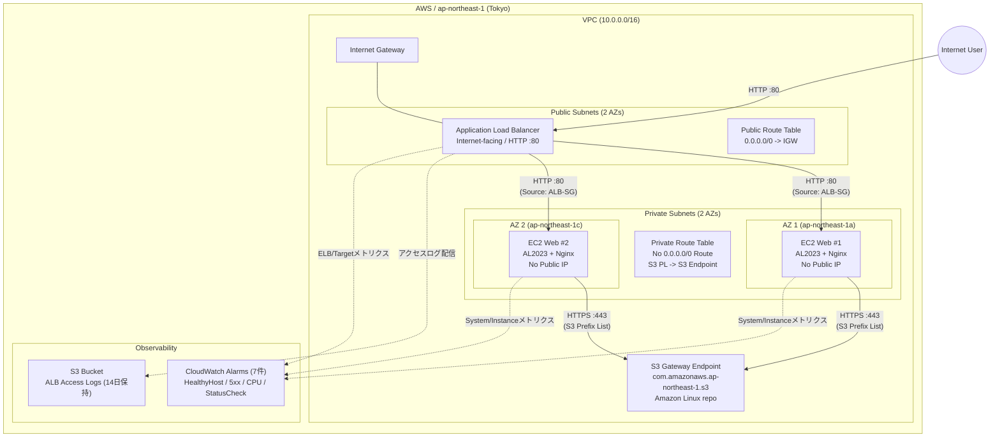

# アーキテクチャ

## 構成図

## 通信ルールとセキュリティ境界

### Security Group ルールマトリクス

| リソース | 方向 | プロトコル / ポート | 送信元 / 宛先 | 用途 / 備考 |
| --- | --- | --- | --- | --- |
| **ALB SG** | Ingress | TCP / 80 | `0.0.0.0/0` | インターネットからのHTTPアクセス |
| **ALB SG** | Egress | TCP / 80 | EC2 SG | バックエンドEC2インスタンスへのトラフィック転送 & Health Check |
| **EC2 SG** | Ingress | TCP / 80 | ALB SG | ALBからの転送のみ許可（直接アクセス不可） |
| **EC2 SG** | Egress | TCP / 443 | `pl-xxxx` (AWS managed S3 prefix list) | AL2023のパッケージリポジトリ（dnf / Nginx導入） |
| **EC2 SG** | Egress | TCP / 80 | 不許可 | 外部Web通信禁止 |
| **EC2 SG** | Ingress | TCP / 22 | 不許可 | SSHアクセス禁止（インターネット・ローカル共に開放なし） |

### ルーティング設計

| Route Table | 宛先 CIDR / ターゲット | 経由先 | 備考 |
|---|---|---|---|
| **Public Route Table** | `0.0.0.0/0` | Internet Gateway (IGW) | ALBのインターネット公開用 |
| **Private Route Table** | S3 Prefix List | S3 Gateway Endpoint | VPCエンドポイント経由通信（無料・プライベート） |
| **Private Route Table** | `0.0.0.0/0` | **なし (Default route 未作成)** | インターネット直出不可・NAT Gateway非配置 |

## AWS固有の設計判断

1. **NAT Gatewayの排除とS3 Gateway Endpointの採用**:
   - Private EC2上のOSパッケージ（Amazon Linux 2023）はAWSが管理するS3リポジトリから配信されます。
   - NAT Gatewayを配置せず、無料のS3 Gateway Endpoint + S3 Managed Prefix ListによるEgress限定ルーティングを採用することで、NAT Gatewayの維持費（約32 USD/月）を削減しつつ十分なセキュリティを担保しました。
2. **2 AZ分散による高可用性**:
   - ALBおよびEC2を東京リージョンの2つの異なるAZ（`ap-northeast-1a`, `ap-northeast-1c`）に跨いで配置し、片系AZ障害への耐性を確保。
3. **完全SSHレス運用**:
   - EC2へのSSHポート開放やキーペア設定を行わず、ユーザーデータ（cloud-init）による自律プロビジョニングのみでNginxを起動。攻撃サーフェスを最小化しています。
