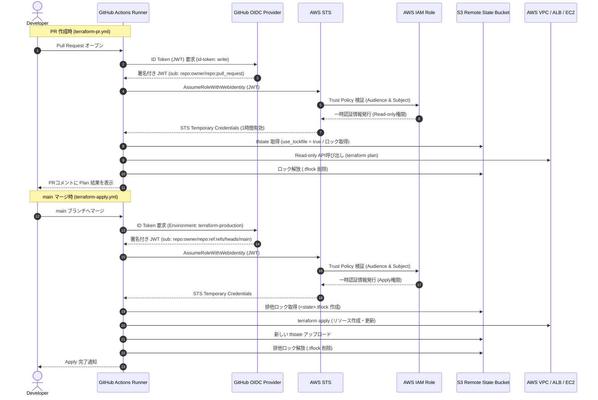

# CI/CD・OIDC・Remote State

## 採用した設計

| 項目 | 設計 |
| --- | --- |
| CI | Pull Requestでformat、init、validateを常時実行する |
| PR plan | 同一リポジトリからのPRに限り、OIDCで認証してRemote Stateに対するplanを実行する |
| apply | `main`へのpushでのみ実行する。GitHub Environment `terraform-production`を使用する |
| AWS認証 | GitHub Actions OIDCで短期STS Credentialを取得する |
| State | S3（バージョニング・SSE-S3・Public Access Block）とS3ネイティブlockfile |
| State保護 | State BucketはHTTPSを強制し、CI RoleにState Objectとlockfileだけを許可する |

Workflowは`.github/workflows/terraform-pr.yml`と`.github/workflows/terraform-apply.yml`にある。Remote Stateの作成とOIDC Roleの作成は、循環依存を避けるため`bootstrap/`で独立して管理する。

## DynamoDB方式から変更した理由

HashiCorpの現行[S3 Backend公式ドキュメント](https://developer.hashicorp.com/terraform/language/backend/s3)では、DynamoDBベースのロックはdeprecatedであり、将来のminor versionで削除予定とされている。そのため、`backend "s3"`に`use_lockfile = true`を設定し、S3に作成される`<state key>.tflock`で排他する方式を採用した。

この方式ではDynamoDBのテーブル、課金、追加IAM権限を不要にできる。公式ドキュメントで指定される最小権限に合わせ、State Objectには`GetObject`と`PutObject`、lockfileには`GetObject`、`PutObject`、`DeleteObject`だけを許可する。State Object自体には`DeleteObject`を付与しない。

## bootstrap用一時権限の最小化

bootstrapを実行する人間のIdentityには、GitHub Actions用の実行Roleとは別に短期間だけ作成権限が必要となる。この一時policyでは、State BucketとTerraform Roleを名前で限定し、`iam:PassRole`およびdestroy用の`DeleteRole`、`DeleteRolePolicy`、`DeleteOpenIDConnectProvider`は付与しない。

AWS IAM Service Authorization Referenceでは、`iam:CreateOpenIDConnectProvider`は`oidc-provider`リソースタイプをResourceに指定できる。そのため一時policyでも`Resource: "*"`を使用せず、GitHub Actionsの`token.actions.githubusercontent.com`だけを表すOIDC Provider ARNへ限定する。

この一時policyはbootstrap完了後に削除する。将来のcleanupでbootstrapリソースを削除する場合は、削除APIだけを別の一時policyとして発行し、通常運用の権限に混在させない。

## OIDC認証・CI/CDパイプラインフロー



長期Access KeyとSecret Access KeyをGitHub Secretsに保存しない。GitHub Actionsの`configure-aws-credentials`がOIDCトークンをSTSへ交換し、ジョブ中だけ有効なCredentialを受け取る。

## IAM設計

`bootstrap/`は次の制限をTrust Policyに設定する。

- Audienceは`sts.amazonaws.com`だけ。
- Subjectは指定した`owner/repository`の`main`、およびPRイベントだけ。
- `main`以外のpushはapply用Roleを引き受けられない。

権限Policyは、State Bucket内の指定State Keyと対応するlockfile、今回のVPC/EC2/ELB構成に必要なEC2およびELB操作に限定する。IAM User、Access Key、NAT Gateway、Elastic IPを作成する権限は含めない。

PRのうちforkからのものでは、AWS認証とplan jobを実行しない。formatとvalidateだけを実行するため、信頼できないコードにAWS権限を渡さない。

## State管理

- S3 Bucket: Public Access Block、Bucket Owner Enforced、バージョニング、SSE-S3を有効化する。
- Bucket Policy: TLSを使わないアクセスを明示的に拒否する。
- S3 native lockfile: `use_lockfile = true`により、State Keyと同じプレフィックスの`<state key>.tflock`を使って同時更新を排他する。
- State Objectの削除権限は付与せず、lockfileの削除だけを許可する。plan artifactは保存しないため、State由来の値を不用意に公開しない。

## 初回セットアップ（人による設定が必要）

OIDC Trust Policyを安全に固定するため、次の2値は正確な値が必要であり、推測して設定してはいけない。

1. GitHubリポジトリ名（`owner/repository`）
2. グローバルで重複しないState Bucket名

設定手順:

1. `bootstrap/terraform.tfvars.example`を`bootstrap/terraform.tfvars`へコピーし、上記2値を設定する。
2. AWSアカウントに既存のGitHub OIDC Providerがあれば、そのARNを`github_oidc_provider_arn`に設定する。なければbootstrapが作成する。
3. `bootstrap`ディレクトリで`terraform init`、`terraform plan`を確認し、`terraform apply`を実行する。
4. bootstrap出力をGitHub Actions Variablesへ設定する。

| GitHub Actions Variable | 値 |
| --- | --- |
| `AWS_REGION` | `ap-northeast-1` |
| `AWS_TERRAFORM_ROLE_ARN` | `github_actions_role_arn`出力 |
| `TF_STATE_BUCKET` | `state_bucket_name`出力 |
| `TF_STATE_KEY` | `state_key`出力 |

5. GitHubで`terraform-production` Environmentを作成し、`main`へのブランチ保護と必要な承認ルールを設定する。
6. ローカルStateのバックアップを保管し、以下を実行する。

```powershell
.\scripts\migrate-state.ps1 `
  -StateBucket "<State Bucket名>"
```

このスクリプトは`terraform init -migrate-state`後にplanを実行する。`No changes`以外の場合はapplyせずに終了するため、差分を確認してから次の操作を判断できる。

## 実行確認結果

- Terraformの既存環境にはRemote Backendをまだ有効化していない。したがって、現在稼働中のStateとリソースに変更はない。
- Root構成とbootstrap構成は、バックエンドを無効化したローカル検証でformat/validateを実行する。
- 実際のRemote State移行、OIDC Role作成、GitHub Actionsの実行は、上記のGitHubリポジトリ名とState Bucket名が確定してから実施する。

## 実施ログと移行結果

### AIが自律的に実施した内容

1. State Bucket名、GitHubリポジトリ名、State Keyをbootstrapのローカル変数ファイルへ設定した。このファイルはGit管理対象外であり、公開ドキュメントには具体値を記載しない。
2. bootstrapの`terraform plan -out=tfplan`を実行し、S3 Bucket、その保護設定、GitHub OIDC Provider、Terraform用IAM RoleとインラインPolicyが追加対象であることを確認した。DynamoDBは計画に含まれなかった。
3. planの確認後に`terraform apply tfplan`を試行した。
4. 失敗後にbootstrap Stateを確認し、管理対象リソースが0件であることを確認した。既存アプリケーション用StateとAWS環境に変更はない。

### 実行したコマンド（一般化）

```powershell
# bootstrap
terraform -chdir=bootstrap plan -out=tfplan
terraform -chdir=bootstrap apply tfplan

# 権限付与後に実行するState移行
.\scripts\migrate-state.ps1 -StateBucket "<State Bucket名>"

# 移行後の確認
terraform plan -lock-timeout=5m
```

### 発生したエラーと原因

bootstrap applyは、実行Identityに次の作成権限がないため停止した。

- State Bucket作成のためのS3権限
- GitHub Actions OIDC Provider作成のためのIAM権限

このエラーはTerraform構成のエラーではなく、最小権限の既存Identityにbootstrap作成権限が付与されていないことによる。失敗時点でStateに作成済みリソースはなく、ロールバック操作は不要だった。

### 人間による介入が必要な内容

AWSアカウント管理者は、次のいずれかを実施する必要がある。

1. 管理者権限を持つ承認済みIdentityで`bootstrap`をapplyする。
2. 現在の実行Identityに、指定State Bucketに限定したS3作成・保護設定権限、GitHub OIDC Provider作成権限、指定Terraform Roleの作成・インラインPolicy設定権限を一時的に付与する。

必要な権限例は、`s3:CreateBucket`、`s3:PutBucketPublicAccessBlock`、`s3:PutBucketOwnershipControls`、`s3:PutBucketVersioning`、`s3:PutEncryptionConfiguration`、`s3:PutBucketPolicy`、`iam:CreateOpenIDConnectProvider`、`iam:CreateRole`、`iam:PutRolePolicy`、および対応する読み取り・タグ付け権限である。広範な常設Administrator権限をGitHub Actions Roleへ与える必要はない。

### apply後に実施する確認

権限付与後、AIは以下を順に実施する。

1. bootstrap plan/applyを再実行する。
2. S3 BucketのVersioning、Public Access Block、暗号化、TLS強制、およびGitHub OIDC Roleを確認する。
3. GitHub Variablesを整理する（`AWS_REGION`、`AWS_TERRAFORM_ROLE_ARN`、`TF_STATE_BUCKET`、`TF_STATE_KEY`）。
4. ローカルStateを上書きしない名前でバックアップする。
5. `use_lockfile = true`を含むS3 BackendへStateを移行する。
6. 移行直後に`terraform plan`を実行し、`No changes`を確認する。差分があればapplyせず停止する。

### 再開試行（権限付与後）

現在の実行Identityを`aws sts get-caller-identity`で確認した（アカウントIDおよびARNは記録しない）。続いて保存済みのbootstrap planを適用したが、次の2つのActionが実行Identityに許可されていなかったため停止した。

- 指定State Bucketに対する` s3:CreateBucket`
- GitHub Actions OIDC Providerリソースに対する`iam:CreateOpenIDConnectProvider`

このため、bootstrapリソース、ローカルStateのバックアップ、Remote State移行、Root構成の再planは実施していない。権限の自動拡張や既存AWS環境への変更も行っていない。apply前のplanは前回と同じ9リソースの追加であり、変更・削除は0件だった。

#### 人間による介入が必要な内容（更新）

現在の一時inline policyに、bootstrap専用として次の許可が実際にアタッチされていることを確認する必要がある。

- `s3:CreateBucket`：指定State Bucket ARNに限定
- `iam:CreateOpenIDConnectProvider`：`token.actions.githubusercontent.com`のOIDC Provider ARNに限定

後者はIAM Service Authorization Reference上、OIDC Providerリソースに限定できる。これらが反映された後にのみbootstrap applyを再開する。Remote State移行にはbootstrap用一時権限を流用せず、別途承認されたState移行用の最小S3権限を使用する。

### 付与状態の読み取り確認

applyを再実行する前に、STSで現在の実行Identityが対象のIAM Userであることを確認した。続いて`iam list-user-policies`を実行したが、当該Userには`iam:ListUserPolicies`が許可されておらず、inline policyの存在や内容はCLIから確認できなかった。

これは一時bootstrap policyが未付与であることを直接示す結果ではなく、IAM設定の参照権限がないことを示す。推測でapplyを再試行せず停止した。管理権限を持つ担当者がIAM Consoleまたは別の監査Identityで、対象Userに一時inline policyが付与され、その内容に` s3:CreateBucket`およびOIDC Provider ARNに限定した`iam:CreateOpenIDConnectProvider`が含まれることを確認する必要がある。

### bootstrap再開結果

管理者による付与確認後、bootstrap planを再実行した。計画は前回と同一で、S3 State Bucketと保護設定、GitHub Actions OIDC Provider、GitHub Actions Terraform RoleおよびそのインラインPolicyの9リソース追加のみであり、既存リソースの変更・削除は0件だった。

保存したplanをapplyしたが、再び` s3:CreateBucket`と`iam:CreateOpenIDConnectProvider`のAccessDeniedで停止した。Terraformのbootstrap Stateは空であり、部分作成されたリソースはない。これ以降のStateバックアップ・Remote Backend移行・Root構成のplanは実施していない。

この結果は、確認済みのinline policyが現在の実行Identityに有効でない、permissions boundaryまたは組織SCPなど別の明示的な制約がある、あるいは対象Userが異なる、のいずれかを示す。追加権限は自動付与せず、IAM管理者がAWS CloudTrailまたはIAM Policy Simulatorを使って当該Userの実効評価を確認するまで停止する。

### 最小policyによる切り分け結果

`s3:CreateBucket`および`iam:CreateOpenIDConnectProvider`だけを含む切り分け用一時policyでbootstrap planを再確認し、9リソース追加・変更/削除0件であることを確認した。

applyでは、次の2つの不足Actionで停止した。権限の拡張、再apply、Root Terraformへの操作は実施していない。

| 不足Action | 対象Resource | 対象Terraform resource | 実行段階 |
| --- | --- | --- | --- |
| `s3:ListBucket` | 指定State Bucket | `aws_s3_bucket.terraform_state` | `HeadBucket` APIによるBucket作成直後の存在確認 |
| `iam:TagOpenIDConnectProvider` | GitHub Actions OIDC Provider | `aws_iam_openid_connect_provider.github_actions[0]` | OIDC Provider作成時のタグ付与 |

`terraform state list`では`aws_s3_bucket.terraform_state`だけが管理対象として記録されている。したがってState Bucketは作成済みだが、Versioning、暗号化、Public Access Block、TLS強制Bucket Policyなど後続の保護設定は未適用である。OIDC ProviderはStateに記録されておらず、実在確認には現在不足しているIAM読み取り権限が必要なため、存在状態は未確定として扱う。

### 追加権限後の再plan結果

`s3:ListBucket`および`iam:TagOpenIDConnectProvider`を追加した後、bootstrap planを再実行した。BucketのState refreshは開始できたが、TLS強制Bucket Policyの現在値を読み取れず、planは完了しなかった。このためapplyは実行していない。

| 不足Action | 対象Resource | 対象Terraform resource | 必要な理由 |
| --- | --- | --- | --- |
| `s3:GetBucketPolicy` | 指定State BucketのBucket ARN | `aws_s3_bucket.terraform_state` | 既存Bucket Policyを読み取り、保護設定の差分を安全にplanするため |

エラー時点の部分的なplan表示は、OIDC ProviderとGitHub Actions Terraform Roleの2リソース追加、変更/削除0件だった。ただしS3 Bucketのrefreshが失敗したため、これは完全な適用計画ではない。権限の自動拡張や再applyは行っていない。

### `s3:GetBucketPolicy`追加後の再plan結果

Bucket Policyの読み取り後、S3 BucketのACLを読み取る段階でplanが停止した。applyは実行していない。

| 不足Action | 対象Resource | 対象Terraform resource | 必要な理由 |
| --- | --- | --- | --- |
| `s3:GetBucketAcl` | 指定State BucketのBucket ARN | `aws_s3_bucket.terraform_state` | 既存BucketのACL設定を読み取り、State refreshと差分確認を安全に完了するため |

部分的なplan表示は前回と同じくOIDC ProviderとGitHub Actions Terraform Roleの2リソース追加、変更/削除0件だったが、S3 Bucket refreshが未完了のため完全な計画ではない。権限の自動拡張、apply、Root Terraformへの操作は行っていない。

### S3/IAM bootstrap権限追加後の再plan結果

S3 Bucket管理、GitHub OIDC Provider管理、GitHub Actions Terraform Role作成・読取・インラインPolicy設定を含む一時policyの付与後にbootstrap planを再実行した。しかし、S3 BucketのCORS設定を読み取る段階で停止したため、完全なplanではない。apply、Root Terraform、Remote State移行は実施していない。

| 不足Action | 対象Resource | 対象Terraform resource | 必要な理由 |
| --- | --- | --- | --- |
| `s3:GetBucketCORS` | 指定State BucketのBucket ARN | `aws_s3_bucket.terraform_state` | State refresh時に既存BucketのCORS設定を読み取り、構成差分を安全に確認するため |

### `s3:GetBucketCORS`追加後の再plan結果

Bucket CORS設定の読み取り後、S3 Bucketの静的Website設定を読み取る段階でplanが停止した。完全なplanではないためapplyは実行していない。

| 不足Action | 対象Resource | 対象Terraform resource | 必要な理由 |
| --- | --- | --- | --- |
| `s3:GetBucketWebsite` | 指定State BucketのBucket ARN | `aws_s3_bucket.terraform_state` | State refresh時に既存BucketのWebsite設定を読み取り、構成差分を安全に確認するため |

権限の自動追加、Root Terraform、既存AWS環境、Remote State移行への操作は行っていない。

### `s3:GetBucketWebsite`追加後の再plan結果

Bucket Website設定の読み取り後、S3 Transfer Acceleration設定を読み取る段階でplanが停止した。完全なplanではないためapplyは実行していない。

| 不足Action | 対象Resource | 対象Terraform resource | 必要な理由 |
| --- | --- | --- | --- |
| `s3:GetAccelerateConfiguration` | 指定State BucketのBucket ARN | `aws_s3_bucket.terraform_state` | State refresh時に既存BucketのTransfer Acceleration設定を読み取り、構成差分を安全に確認するため |

### `s3:GetAccelerateConfiguration`追加後の再plan結果

Transfer Acceleration設定の読み取り後、S3 BucketのRequest Payment設定を読み取る段階でplanが停止した。完全なplanではないためapplyは実行していない。

| 不足Action | 対象Resource | 対象Terraform resource | 必要な理由 |
| --- | --- | --- | --- |
| `s3:GetBucketRequestPayment` | 指定State BucketのBucket ARN | `aws_s3_bucket.terraform_state` | State refresh時に既存BucketのRequest Payment設定を読み取り、構成差分を安全に確認するため |

### `s3:GetBucketRequestPayment`追加後の再plan結果

Request Payment設定の読み取り後、S3 BucketのServer Access Logging設定を読み取る段階でplanが停止した。完全なplanではないためapplyは実行していない。

| 不足Action | 対象Resource | 対象Terraform resource | 必要な理由 |
| --- | --- | --- | --- |
| `s3:GetBucketLogging` | 指定State BucketのBucket ARN | `aws_s3_bucket.terraform_state` | State refresh時に既存BucketのServer Access Logging設定を読み取り、構成差分を安全に確認するため |

### `s3:GetBucketLogging`追加後の再plan結果

Server Access Logging設定の読み取り後、S3 BucketのLifecycle設定を読み取る段階でplanが停止した。完全なplanではないためapplyは実行していない。

| 不足Action | 対象Resource | 対象Terraform resource | 必要な理由 |
| --- | --- | --- | --- |
| `s3:GetLifecycleConfiguration` | 指定State BucketのBucket ARN | `aws_s3_bucket.terraform_state` | State refresh時に既存BucketのLifecycle設定を読み取り、構成差分を安全に確認するため |

### 集約一時policyによる完全plan結果

State Bucketの読み取り、作成・保護設定、OIDC Provider、GitHub Actions Terraform Roleに必要な一時権限を集約した後、bootstrap planはAccessDeniedなく完了した。

ただし、過去の途中失敗で`aws_s3_bucket.terraform_state`がTerraform State上でtaintedになっている。完全なplanは、当該Bucketをdestroyして同名Bucketを再作成する置換を含んだ（9追加、0変更、1削除）。このBucketはState移行前であるものの、既存Bucketの削除を自動的に安全と判断してはならないためapplyは実行していない。

安全な次の操作は、Bucketの実在・内容・保護設定を読み取り確認したうえで、既存Bucketを維持して`terraform untaint`によりState上の不正なtaint状態だけを解消し、再planすることである。この操作はTerraform Stateを変更するため、明示的な承認後に実施する。Root Terraform、既存アプリケーション環境、Remote State移行には進んでいない。

### taint解消後のbootstrap apply結果

State Bucketが空であることを読み取り確認した後、明示的な承認に基づき`terraform untaint aws_s3_bucket.terraform_state`を実行した。再planは8追加、State Bucketのタグ更新1件、削除0件となり、Bucketの削除・再作成は含まれなかったためapplyを開始した。

applyでは、State BucketのPublic Access Block、Ownership Controls、Versioning、SSE-S3暗号化、TLS強制Bucket Policy、GitHub OIDC Provider、およびGitHub Actions Terraform Roleまで作成・State記録された。一方、次の2件によりapplyは完了していない。

| 種別 | 内容 | 対象 |
| --- | --- | --- |
| IAM権限不足 | `iam:ListAttachedRolePolicies`が不足 | GitHub Actions Terraform Role ARN / `aws_iam_role.github_actions_terraform` |
| Terraform構成エラー | インラインPolicy documentに`ReadAndWriteTerraformState`という重複した`Sid`がある | `data.aws_iam_policy_document.github_actions_terraform` |

Role用インラインPolicy（`aws_iam_role_policy.github_actions_terraform`）は未作成である。上記AccessDeniedにより、権限の自動追加、再apply、Root Terraform、Remote State移行は行っていない。重複SidはIAM policy documentとして無効であり、権限が解決した後でもTerraformコードの修正が必要となる。

### inline policy修正とbootstrap完了結果

`data.aws_iam_policy_document.github_actions_terraform`内の重複Sidを、`ListTerraformState`および`ReadAndWriteTerraformStateObject`へ変更した。Action、Effect、Condition、Resource範囲は変更していない。`terraform fmt -check -recursive`および`terraform -chdir=bootstrap validate`は成功した。

最初の修正後planでは、前回の部分失敗でGitHub Actions Terraform Roleもtaintedになっており、Role置換を含んでいた。この不要な削除を避けるため、明示的な実行方針に基づき`terraform untaint aws_iam_role.github_actions_terraform`を実施し、削除0件のplanへ戻した。

削除0件のplanで、Role用inline policyの追加とGitHub OIDC Provider設定の同期をapplyした。apply結果は1追加、1変更、0削除だった。すべてのbootstrapリソースがStateに記録された。

post-apply planでは、GitHub OIDC Providerの空の`thumbprint_list`とAWS側で自動管理されるthumbprintの差により、恒常的な設定差分が検出された。AWS Provider 5.88系の挙動に合わせ、OIDCの信頼条件、URL、Audience、Resource範囲を変えずに`thumbprint_list`だけを`lifecycle.ignore_changes`へ追加した。formatとvalidateを再実行後、bootstrap planは`No changes`となった。

最終確認済みのbootstrapリソースは次のとおり。

- State Bucket
- Bucket Versioning
- SSE-S3暗号化
- Public Access Block
- Ownership Controls
- TLS強制Bucket Policy
- GitHub Actions OIDC Provider
- GitHub Actions Terraform Role
- Role inline policy

この完了時点でも、Root Terraform、既存アプリケーション環境、Local StateのRemote State移行には操作していない。

### Remote State移行の事前準備

Remote State移行は、bootstrap用の一時高権限を流用しない方針とした。現在のLocal Stateを上書きしないバックアップ名へ複製し、SHA-256ハッシュ一致を確認した。`backend.tf`にはS3 backendと`use_lockfile = true`のみを定義し、Bucket名、State Key、Region、暗号化指定はGit管理対象外の`terraform init -backend-config`引数として渡す設計を維持している。

ローカルには専用のAWS CLI profileが存在しないことを確認した。最小権限のRemote State移行用Identityまたはprofileが提供されるまで、S3へのState書込み、`terraform init -migrate-state`、Root Terraform planは実行しない。これによりbootstrap用一時高権限をRemote State移行に流用しない。

### Remote State移行専用profileの確認結果

指定された`terraform-state-migration` profileでSTS Identity確認を試行したが、このCodex実行環境のAWS CLI設定には当該profileが存在しなかった。このため、S3への書込み、`terraform init -migrate-state`、lockfile検証、Root Terraform planは実行していない。

Local Stateと事前作成済みバックアップの存在を確認し、SHA-256ハッシュが一致することは再確認した。AWSへの変更、既存リソースへのapply、bootstrap用一時高権限の利用は行っていない。profileがこの実行環境から参照可能になった後に、専用profileだけを使用して移行を再開する。

### Local StateからS3 Remote Stateへの移行結果

移行専用の一時S3権限が付与され、bootstrap用一時高権限が対象Userから外れていることをIAM Consoleで確認した。既存のローカルAWS Credentialを`terraform-state-migration` profileとしてローカル設定へ登録し、STS Identity確認に成功した。Credential値、アカウントID、ARN、Bucket名は記録しない。

移行前にLocal Stateとバックアップの存在およびSHA-256一致を再確認した。Rootの`backend.tf`にはS3 backendと`use_lockfile = true`を定義し、実環境のBucket、State Key、リージョン、暗号化は`terraform init -backend-config`引数としてのみ与えた。

実行した移行コマンド（値は一般化）:

```powershell
$env:AWS_PROFILE = "terraform-state-migration"
terraform init -migrate-state -force-copy -input=false `
  -backend-config="bucket=<State Bucket>" `
  -backend-config="key=terraform/aws-validation.tfstate" `
  -backend-config="region=ap-northeast-1" `
  -backend-config="encrypt=true"
```

最初の`-migrate-state -input=false`はTerraformのState copy確認入力を要求して停止した。Local State、バックアップ、AWSリソースには変更がなかったため、バックアップ確認済みかつ明示的承認済みの移行として`-force-copy`を追加して再実行し、S3 backendの初期化とState copyを完了した。

移行後、指定State KeyのS3 Objectが存在し空でないことを専用profileで確認した。`use_lockfile = true`を有効にしたRoot `terraform plan -lock-timeout=5m`は、Remote Stateのlockを取得・解放して`No changes`で完了した。plan後に対応する`.tflock` Objectが存在しないことも確認し、S3 native lockfileが必要時に作成・削除されることを検証した。

#### 使用した最小S3権限

- Bucket（State Keyおよびlockfile prefixに限定）: `s3:ListBucket`
- State Object: `s3:GetObject`、`s3:PutObject`
- Lockfile Object: `s3:GetObject`、`s3:PutObject`、`s3:DeleteObject`

SSE-S3を利用するため、KMS権限は使用していない。State Objectおよびlockfile以外のObject操作、Bucket設定変更、IAM変更は移行用profileでは実行していない。

#### 整合性・安全性の確認

- Local Stateのバックアップは移行前のStateとSHA-256一致。
- S3上のRemote State Objectが存在し空でないことを確認。
- Root `terraform plan`は`No changes`。
- apply、destroy、recreateは実行していない。
- bootstrap用高権限はRemote State移行に使用していない。

#### 人間介入とAI自律実行

- 人間: 移行専用の最小S3権限を設定し、bootstrap権限を外し、ローカルAWS profileの利用とState移行を承認。
- AI: backupハッシュ確認、backend定義準備、profileのSTS確認、State移行、S3 Object確認、lockfile確認、Root plan、結果の記録。

### Pull Request Workflow 実動作確認（開始前ブロック）

Pull Request検証を開始する前に、作業ディレクトリが対象GitHubリポジトリとして初期化されていることを確認した。このディレクトリには固有の`.git`ディレクトリがなく、GitHubの指定リポジトリへの読み取り専用照会も、現在の認証ではリポジトリ未検出またはアクセス不可として失敗した。

誤ったリポジトリへのpushや、無関係なファイルのcommitを防ぐため、feature branch作成、ファイル変更、push、Pull Request作成、GitHub Actions起動、AWS認証は実行していない。AWSリソース、Remote State、Terraform構成は変更していない。

再開には、対象リポジトリへのアクセス権を持つGitHub認証と、対象リポジトリをこの作業ディレクトリへcloneするか、このディレクトリを対象リポジトリとして初期化する明示的な指定が必要である。

### Pull Request Workflow 実動作確認（初回実行）

対象GitHubアカウントの公開リポジトリを新規作成し、認証情報、State、環境固有のbackend設定、planファイルを除外した初回commitを`main`へpushした。次に、Terraformリソース定義を変更しないREADMEの1行更新だけを含むfeature branchを作成し、Pull Requestを作成した。

最初のPRではworkflowの`paths`条件にREADMEが含まれず、checkが起動しなかった。要件どおりすべてのPull Requestで検証を行うため、この`paths`条件を削除した。Terraformリソース定義、AWS環境、Remote Stateには変更していない。

更新後のPR workflowは起動した。`Format and validate` jobは成功し、`terraform fmt -check -recursive`、Rootおよびbootstrapの`terraform init -backend=false`、`terraform validate`が完了した。

一方、trusted PR向けplan jobは、GitHub Actions VariableのAWSリージョン値が未設定のため、AWS認証Actionの入力検証で失敗した。この時点でOIDCによる一時Credentialの取得、S3 Remote Stateの読取り、lockfile利用、`terraform plan`は開始していない。IAM不足やOIDC Trust Policyの不一致ではないため、AWS権限は変更していない。

再開時には、GitHub ActionsのRepository Variablesへ、リージョン、State Bucket、State Key、Terraform Role ARNに相当する4値を設定する必要がある。値そのもの、AWS Account ID、Role ARN、Bucket実名は公開ドキュメントへ記載しない。

### Pull Request Workflow 実動作確認（Variables設定後）

Repository Variablesへ必要な4値を登録した後、PRを更新して新しいworkflow runを起動した。`Format and validate`は再度成功した。trusted PR plan jobは`id-token: write`権限を用いてOIDCでRole引受を試みたが、`sts:AssumeRoleWithWebIdentity`が拒否されて失敗した。したがって、一時Credentialの発行、S3 Remote Stateの読取り、lockfile操作、Terraform planは実行されていない。

原因をbootstrapの入力設定と照合したところ、IAM RoleのOIDC Trust Policyで許可しているGitHubリポジトリ識別子が、実際に作成・利用しているリポジトリ識別子と一致していなかった。これはIAM RoleのTrust Policy設定の問題であり、S3 IAM Policy、State Bucket、Terraform定義、GitHub Secretsの問題ではない。

AWS権限は自動拡張していない。再開には、既存GitHub Actions Terraform RoleのTrust Policyにある`token.actions.githubusercontent.com:sub`条件を、実際のGitHub owner/repositoryのPR用subjectを許可する最小範囲へ修正する必要がある。fork PRへAWS権限を渡さない方針を維持するため、対象リポジトリ以外を許可するワイルドカード条件は使用しない。

### OIDC Trust Policy 修正の事前検証（権限不足で停止）

Trust PolicyのTerraform定義を、同一リポジトリからの`pull_request` subjectと、`terraform-production` Environment subjectだけを許可する内容へ更新した。`aud`は`sts.amazonaws.com`のままとし、OIDC Provider URL、GitHub Actions Roleの権限Policy、S3権限、その他のIAM権限は変更していない。`terraform fmt -check -recursive`およびbootstrapの`terraform validate`は成功した。

bootstrap planは、State refresh時の権限不足で停止した。確認できた対象は次のとおり。

- S3 State Bucketを読むための`HeadBucket` APIが403となった（対象Terraform resource: State Bucket）。S3の403は権限詳細を返さないため、この結果だけでは不足IAM Actionを断定しない。
- `iam:GetOpenIDConnectProvider`が拒否された（対象Terraform resource: GitHub OIDC Provider）。

このため、既存RoleのTrust Policyだけであることのplan確認、apply、post-apply plan、GitHub Actionsの再実行は行っていない。権限は自動追加していない。再開には、bootstrap refreshに必要な既存S3 State Bucket読取権限と、既存OIDC Provider読取権限を一時的に付与したIdentityでplanを成功させる必要がある。Account ID、Bucket名、Role ARN、Request IDは記録しない。

### Bootstrap一時読取Policyの追加後

AWS Consoleで、既存State Bucket、GitHub OIDC Provider、GitHub Actions Terraform Roleに限定した`BootstrapTemporaryPolicy`をIAM Userへ作成・付与した。削除権限、作成権限、`iam:PassRole`は含めていない。

この状態でbootstrap planを再実行したところ、State Bucketの各種設定とOIDC Providerのrefreshは成功した。しかし、GitHub Actions Terraform Roleに設定されたinline policyの読取りで`iam:GetRolePolicy`が拒否された（対象Terraform resource: GitHub Actions Terraform Role）。

指示どおり、`iam:GetRolePolicy`を自動追加せず、Trust Policyのapply、post-apply plan、GitHub Actions workflow再実行は行っていない。再開には、対象GitHub Actions Terraform Roleに限定した`iam:GetRolePolicy`を一時bootstrap policyへ追加する必要がある。実環境識別子は公開記録に残さない。

### OIDC Trust Policyの反映と再試験

対象GitHub Actions Terraform Roleに限定した一時bootstrap権限へ`iam:GetRolePolicy`が追加された後、bootstrap planを再実行した。planはGitHub Actions Terraform RoleのTrust Policyをin-placeで更新する変更だけであり、追加0件、削除0件だった。Role inline policyの権限内容およびResource範囲に変更はなかった。

applyは既存RoleのTrust Policyだけを更新し、結果は追加0件、変更1件、削除0件だった。post-applyのbootstrap planは`No changes`となった。

反映後に同一リポジトリ起点のPull Request workflowを再実行した。`Format and validate` jobは成功した。plan jobには必要最小限の`id-token: write`が設定されており、OIDCによる一時Credential取得を試行したが、`sts:AssumeRoleWithWebIdentity`が拒否された。そのためTerraform init、S3 Remote State読取り、lockfile操作、terraform planは実行されていない。

AWS側の読み取り確認では、OIDC Provider URLはGitHub Actionsの正規endpoint、Audienceは`sts.amazonaws.com`、Trust Policyの許可subjectは対象リポジトリの`pull_request`および`terraform-production` Environment用に限定されていた。workflow permissionsも設定済みである。このため、次に確認すべき点は実行時にGitHubが発行したOIDC tokenの`sub` claimである。

安全のため、raw JWTやCredentialをログ出力しない。再開する場合は、短時間だけ有効な診断stepで`sub`と`aud`だけを出力し、Trust Policyとの一致を確認する。確認後は診断stepを削除する。fork由来PRにはplan jobを実行しない既存条件を維持し、IAM権限の自動拡張やワイルドカードによるTrust Policy緩和は行わない。

#### この時点の担当範囲

- 人間: 一時bootstrap policyへの`iam:GetRolePolicy`追加、およびTrust Policy更新の実行許可。
- AI: Terraform定義のTrust Policy修正、format/validate、plan差分の確認、Role更新、post-apply `No changes`確認、PR workflow再実行、失敗箇所の切り分け、匿名化した記録。

### OIDC claimの一時診断結果

Pull Request workflowだけに一時的な診断stepを追加した。stepはGitHub OIDC tokenを取得してrunner内でpayloadをdecodeしたが、JWT全文、header、signature、token本体、AWS Credential、Secret、`sub`および`aud`以外のclaimは出力していない。AWS AssumeRoleは診断stepでは実行していない。

確認結果は次のとおりである（識別子は一般化）。

- `aud`: `sts.amazonaws.com`
- 実際の`sub`: `repo:<owner>@<repository-id>/<repository>:pull_request`
- Trust Policyで許可していた`sub`: `repo:<owner>/<repository>:pull_request`

`aud`は一致している。一方、GitHubが発行した`sub`にはリポジトリ名の後ろではなくownerとrepositoryの間にリポジトリIDを含むカスタムsubject形式が使用されていたため、Trust Policyの`sub`条件と一致せず、`sts:AssumeRoleWithWebIdentity`が拒否された。workflowの`id-token: write`とOIDC Provider URLは原因ではない。

この時点でTrust Policy、Role権限、S3権限は変更していない。診断stepは確認後に削除する一時コードとしてfeature branchに残しており、次の修正を実施する前に削除する。次の作業では、確認済みの正確な`sub`形式にTrust Policyを最小範囲で合わせ、その後に診断stepを削除して再実行する。

### custom subject対応後のPull Request workflow再実行

確認済みのPull Request用custom `sub`をbootstrap入力へ追加し、Trust PolicyのPull Request subjectだけをin-placeで更新した。Environment用subject、OIDC Provider、Audience、GitHub Actions Role inline policy、S3権限は変更していない。一時診断stepは削除した。

bootstrap planは既存GitHub Actions RoleのTrust Policy更新1件だけを示し、追加0件、削除0件だった。apply後のbootstrap planは`No changes`となった。

Pull Request workflowの再実行では、次をすべて確認した。

- `terraform fmt -check -recursive`、Root/Bootstrapのinitとvalidateが成功。
- `id-token: write`を使用したGitHub OIDC Role引受が成功。
- 長期AWS Access Key/Secret Access KeyをGitHub Secretsに保存せず、OIDCの一時Credentialで実行。
- S3 Remote Backendの初期化とState読取りが成功。
- `use_lockfile = true`を用いたTerraform planが完了。
- plan結果は`No changes`。
- Pull Request workflowにterraform applyは存在せず、fork PRを除外する条件も維持。

この検証の完了後、Trust Policyは実際に検証したPull Request subjectだけを許可している。`terraform-production` Environment向けのcustom subjectは未検証であり、main mergeのapply workflowを有効にして検証する前に、Environment実行時の`sub`を同じ方法で確認する必要がある。

### terraform-production Environment用OIDC subjectの事前確認

mainへのpushでapply workflowを実行する前に、Pull Request workflowへ一時的なread-only診断jobを追加した。このjobは`terraform-production` Environmentを指定し、OIDC tokenのpayloadから`sub`と`aud`だけを出力した。AWS Role引受、Terraform backend初期化、State操作、terraform applyは実行していない。

確認結果は次のとおりである（識別子は一般化）。

- `aud`: `sts.amazonaws.com`
- 実際のEnvironment `sub`: `repo:<owner>@<owner-id>/<repository>@<repository-id>:environment:terraform-production`
- 現在Trust PolicyにあるEnvironment `sub`: `repo:<owner>/<repository>:environment:terraform-production`

Audienceは一致しているが、Environment用subjectもPull Request用subjectと同様にcustom形式で発行されることを確認した。したがって、現時点でmain mergeのapply workflowを実行するとOIDC Role引受が拒否される。Trust Policy、Role inline policy、S3権限には変更を加えていない。

一時診断jobは確認直後に削除した。次の作業では、確認済みEnvironment subjectをTrust Policyへ最小範囲で追加し、bootstrap planでRole Trust Policyだけの更新であることを確認してから適用する。

### Environment subjectのTrust Policy反映

確認済みの`terraform-production` Environment用custom subjectをbootstrap入力へ追加し、Trust PolicyのEnvironment subjectだけをin-placeで更新した。Pull Request用subject、OIDC Provider、Audience、Role inline policy、S3権限、アプリケーション用Terraformリソースには変更を加えていない。

formatとbootstrap validateは成功した。bootstrap planは既存GitHub Actions Terraform RoleのTrust Policy変更1件だけを示し、追加0件、削除0件だった。apply結果も追加0件、変更1件、削除0件であり、post-apply bootstrap planは`No changes`となった。

この時点で、Trust Policyは実行確認済みの同一リポジトリPull Request subjectと`terraform-production` Environment subjectを最小範囲で許可している。次の段階は、mainへのmergeでapply workflowを起動し、Environment OIDCによるRole引受、Remote Stateのlockfile、plan、およびNo changes時のapply完了を確認することである。

### main merge後のapply workflow実動作確認

最終Pull Requestチェックが成功し、確認済みのfeature branchをmainへmergeした。mainへのpushで`terraform-production` Environmentを使用するapply workflowが起動した。

workflowでは、GitHub OIDCによる一時CredentialでRole引受に成功した。長期AWS Access KeyおよびSecret Access KeyをGitHub Secretsへ保存・使用していない。S3 Remote Backendの初期化とState読取りが完了し、`use_lockfile = true`を用いたterraform planが成功した。

planは`No changes`で完了した。その確定planを引数としてterraform applyを実行し、結果は追加0件、変更0件、削除0件だった。既存AWS環境のdestroy、recreate、意図しない変更は発生していない。

この確認により、同一リポジトリのPull Requestではread-only plan、main mergeでは`terraform-production` Environmentを介したOIDC認証・plan・applyというCI/CDフローが実動作することを確認した。

### 実変更apply検証とWindows改行コードの再現性対策

CI/CDの実変更を確認するため、既存ALBへ検証用タグを1件追加するだけのPull Requestを作成した。PR workflowはformat、validate、OIDC Role引受、Remote State planに成功し、plan差分は既存ALBのin-place tag更新1件だけ（追加0件、削除0件、置換なし）だった。

main merge後のapply workflowは、OIDC認証、S3 backend、lockfileを使うplan、保存済みplanのapplyに成功した。apply結果は追加0件、変更1件、削除0件であり、更新内容は検証用タグだけだった。

post-apply確認の初回ローカルplanでは、EC2の`user_data`ハッシュ差によりEC2 2台とTarget Group登録の置換が表示された。この差分にはapplyを実行していない。原因を調査したところ、Windowsの`core.autocrlf=true`と`.gitattributes`未設定により、Terraform heredocを含む`.tf`ファイルがCRLFへ変換されていた。AWS上のdriftではなかった。

再発防止として`.gitattributes`で`*.tf`、`*.tfvars`、`*.tfvars.example`をLF固定とした。Terraform sourceをLFへ正規化して再度Remote State planを実行した結果、`No changes`を確認した。生成したroot planファイルはGit管理対象外とした。
