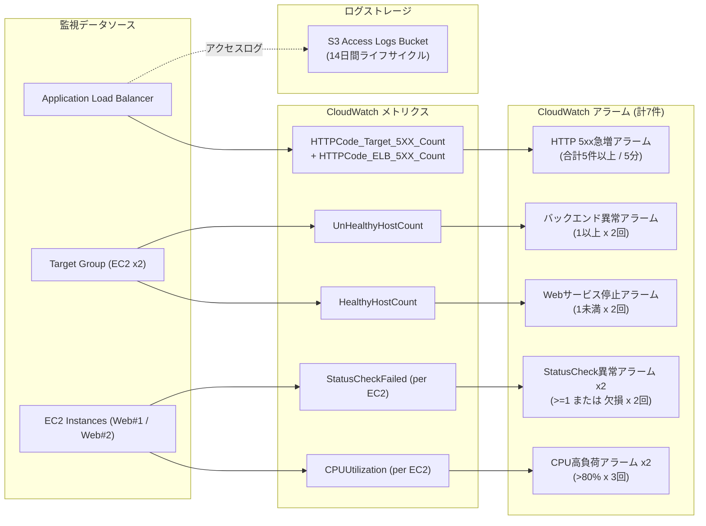

# 最低限の監視設計

## 目的

既存のALB、Private EC2、Nginxで構成するWebシステムに対し、障害検知と初動調査に必要な最低限の監視をTerraformで追加する。高額な常時収集基盤や通知先未確定のサービスは追加しない。

## 採用設計

### 使用するAWSサービス

- **Amazon CloudWatch**: ALBとEC2が標準で発行するメトリクスに対するアラーム。
- **Amazon S3**: ALBアクセスログの保存先。Public Access Block、SSE-S3、TLS強制、14日ライフサイクルを設定する。
- **Application Load Balancer access logs**: リクエスト、応答、接続先を障害調査用にS3へ配信する。

CloudWatch Agent、CloudWatch Logs、NAT Gateway、EC2への追加IAM Role、SNSは採用しない。Private EC2で追加エージェントを動かしたり、通知先未指定のまま外部通知を送信したりせず、標準メトリクスとALBログで必要最小限の可観測性を確保する。

## 監視項目とアラーム条件



| 目的 | CloudWatch metric | 条件 | 判定理由 |
| --- | --- | --- | --- |
| Webサービス停止 | `HealthyHostCount` | 1未満、1分×2回 | 全Targetが利用不能となり、ALB経由のWeb提供ができない状態を検知する。 |
| バックエンド異常 | `UnHealthyHostCount` | 1以上、1分×2回 | 片系障害を含むTargetの健全性低下を早期検知する。 |
| HTTP 5xx増加 | `HTTPCode_Target_5XX_Count` + `HTTPCode_ELB_5XX_Count` | 合計5件以上/5分 | Target起因とALB起因の5xxを1つのアラームで検知する。 |
| EC2 CPU異常 | `CPUUtilization` | 平均80%以上、5分×3回、各EC2 | 瞬間的なスパイクを避けつつ、継続的なCPU逼迫を個別に検知する。 |
| EC2停止・Status Check異常 | `StatusCheckFailed` | 1以上またはデータ欠損、1分×2回、各EC2 | 障害試験で判明したALB `UnHealthyHostCount`の停止インスタンス検知ギャップを補う。 |

`HealthyHostCount`、`UnHealthyHostCount`、Target/ALBのHTTP 5xxは`AWS/ApplicationELB`の標準メトリクスである。`HTTPCode_Target_5XX_Count`はTargetが返した5xx、`HTTPCode_ELB_5XX_Count`はALBが発生させた5xxを対象とする。[AWS公式メトリクス仕様](https://docs.aws.amazon.com/elasticloadbalancing/latest/application/load-balancer-cloudwatch-metrics.html)

アラームアクションは設定しない。通知先が未指定の検証段階では、CloudWatch ConsoleのAlarm stateとS3アクセスログで確認する。通知先が決まった時点で、SNSまたは既存の運用通知基盤を別変更として追加する。

## ログ・メトリクス取得方法

ALBアクセスログを専用S3バケットの限定prefixへ配信する。バケットは同一リージョンに作成し、ELBログ配信Service Principalへ対象アカウントのprefixだけに`PutObject`を許可する。S3 Public Access Block、Bucket Owner Enforced、SSE-S3、TLS強制を設定し、14日後に自動削除する。ALBのアクセスログ属性とS3配信要件は[AWS公式ガイド](https://docs.aws.amazon.com/elasticloadbalancing/latest/application/load-balancer-access-logs.html)に従う。

メトリクスはCloudWatch Consoleで、ALB/Target Group/EC2の各dimensionを指定して確認する。追加のcustom metricやLogs Insights課金を避けるため、初期構成では標準メトリクスだけを使う。

## 想定コスト

- CloudWatch: 論理アラーム7件。標準解像度アラームは1 alarm-metricあたり月額0.10 USDが料金例として示されている。5xxのmetric mathは2つの基礎メトリクスを参照するため、無料枠を除き概算で月額0.70〜0.80 USD程度を見込む。実際の請求はリージョン、無料枠、メトリクス課金単位で確認する。[CloudWatch料金](https://aws.amazon.com/cloudwatch/pricing/)
- S3: 保存量、PUT request、取得量に応じた従量課金。14日で削除するため、低トラフィックの検証環境では小額を想定する。S3には最低料金はなく、使用量に応じて課金される。[S3料金](https://aws.amazon.com/jp/s3/pricing/)
- 追加しないもの: NAT Gateway、CloudWatch Agent、CloudWatch Logs ingest、custom metric、SNS、外部監視サービス。

## Terraform変更内容

- `monitoring.tf`: S3ログバケット、アクセスログ用Bucket Policy、CloudWatch metric alarm 7件。
- `variables.tf`: しきい値、評価期間、ログ保持日数、prefixを変数化。
- `main.tf`: ALBのaccess logsを有効化。既存の通信設定・Target Group・EC2設定には変更しない。
- `bootstrap/`: GitHub Actions Terraform Roleに、監視アラームとログバケットだけを作成・読取・削除する最小権限を追加。

Rootのlocal plan結果は **11追加、1変更、0削除** だった。追加はアラーム5件とログバケット関連6件、既存リソースの変更はALBのアクセスログ有効化だけである。既存リソースのdestroy/recreateは含まれない。

## GitHub Actions・適用状況

GitHub Actions Roleの監視権限を反映するbootstrap applyは完了した。適用内容は既存Role inline policyのin-place更新1件のみで、0追加、1変更、0削除だった。適用後のbootstrap planは`No changes`となった。

監視変更のPull Requestでは、format、init、validate、GitHub OIDC認証、S3 Remote Stateを利用したplanがすべて成功した。PR planは11追加、1変更、0削除で、applyは実行されていない。mainへのmerge後にapply workflowが起動し、同じ差分を11追加、1変更、0削除で適用した。再実行したmain workflowではplanが`No changes`、applyが0追加、0変更、0削除となり、Remote Stateと実環境の整合性を確認した。長期AWS Access KeyはGitHub Secretsで使用していない。

障害試験で判明したEC2停止検知ギャップの修正Pull Requestでも、同じOIDC認証とRemote Stateを使用したplanが成功した。差分はEC2 Status Checkアラーム2件の追加だけで、0変更、0削除、既存リソースの置換なしだった。main workflowは2追加、0変更、0削除で適用に成功し、再実行時のplanは`No changes`、applyは0追加、0変更、0削除となった。

障害試験は、監視自体の適用と整合性確認が完了した後の別工程とし、サービス影響を伴う操作の承認前には実行していない。

## 発生したエラーと修正方針

### bootstrap IAM更新のAccessDenied

bootstrap planは、既存GitHub Actions Terraform Roleのinline policyをin-place更新する1件だけを示した。applyでは次の権限が不足して停止した。

- 不足Action: `iam:PutRolePolicy`
- 対象Resource: GitHub Actions Terraform Role（実ARNは記載しない）
- 対象Terraform resource: `aws_iam_role_policy.github_actions_terraform`

人間の明示承認後、AWS Consoleからbootstrap専用の一時inline policyへ、対象Roleに限定した`iam:PutRolePolicy`だけを追加した。`iam:PassRole`、AdministratorAccess、ワイルドカードResourceは追加していない。再実行したbootstrap planはRole inline policy更新だけを示し、apply後のplanは`No changes`となった。

### ローカルCredential CSVの不在

過去に利用したローカルCredential CSVは見つからなかった。既存のローカルAWS認証設定で読み取りplanは成功したため、Credentialの表示・保存・再作成はしていない。

### 適用後ローカルplanのS3 AccessDenied

監視適用後のローカルplanでは、実行IAM Userに新規ALBログバケットの`S3:ListBucket`権限がなく、`aws_s3_bucket.alb_access_logs`のrefreshで停止した。既存AWSリソースへの変更やapplyは発生していない。

確認専用のread-only inline policyを追加しようとしたが、IAM Userに設定できるinline policyの合計サイズ上限に達したため保存できなかった。既存ポリシーの削除・置換や権限拡張は行わず、作成画面をキャンセルした。代わりに、監視リソースへの必要最小限の読取権限を既に持つGitHub OIDC Roleでmain workflowを再実行し、planの`No changes`とapplyの0変更を確認した。

## 障害試験結果

```mermaid
sequenceDiagram
    autonumber
    actor Tester as 検証者 (AI/Human)
    participant ALB as Application Load Balancer
    participant EC2A as EC2 Web #1 (Target A)
    participant EC2B as EC2 Web #2 (Target B)
    participant CW as CloudWatch (StatusCheck / Unhealthy)
    actor Client as 外部クライアント (curl)

    Note over EC2A,EC2B: 正常運用フェーズ (両系稼働)
    Client->>ALB: HTTP GET /
    ALB->>EC2A: 正常ルーティング
    ALB-->>Client: HTTP 200 OK (Traffic distributed)

    Note over Tester,EC2A: 障害注入 (EC2 Web #1 を意図的停止)
    Tester->>EC2A: ec2 stop-instances
    EC2A-->>EC2A: インスタンス停止
    EC2A-.->|メトリクス欠損/StatusCheck 失敗| CW
    CW-->>CW: StatusCheckFailed アラーム発報 (ALARM)
    ALB-->>ALB: Target A を未稼働(unused)として除外

    Note over Client,ALB: サービス継続性確認
    Client->>ALB: HTTP GET /
    ALB->>EC2B: 健全な Target B に自動集約
    ALB-->>Client: HTTP 200 OK (無停止継続)

    Note over Tester,EC2A: 復旧フェーズ (EC2 再起動)
    Tester->>EC2A: ec2 start-instances
    EC2A-->>EC2A: Nginx 起動 & 初期化完了
    ALB->>EC2A: Health Check (HTTP :80)
    EC2A-->>ALB: 200 OK
    ALB-->>ALB: Target A を healthy へ復帰
    CW-->>CW: StatusCheckFailed アラーム解消 (OK)
```

人間の明示承認後、正常なport 80 Targetを残した状態でバックエンド異常検知を試験した。

最初にEC2を1台だけ一時停止した。ALBは残る1台でHTTP 200を維持したが、停止したTargetは`unhealthy`ではなく`unused`として扱われ、`UnHealthyHostCount`アラームは発報しなかった。EC2を直ちに再起動し、port 80のTarget 2台がともに`healthy`へ戻ったことを確認した。この結果から、停止インスタンス検知にはEC2 StatusCheckまたは別のアラームが必要であり、ALBの`UnHealthyHostCount`だけでは停止状態を直接検知できない場合があると分かった。

この検知ギャップへの修正として、各EC2の`StatusCheckFailed`アラームを追加した。1分間隔で2回連続の失敗、または停止に伴うメトリクス欠損を異常として扱う。ALBのTarget異常とEC2自体の停止・Status Check異常を分けて検知できる構成とした。追加後のGitHub Actions applyと最終`No changes`確認も完了している。

次に、既存のport 80 Target 2台には触れず、同じEC2の未使用port 81を試験用Targetとして一時登録した。health check timeoutにより試験Targetが`unhealthy`となり、`UnHealthyHostCount`が2評価期間連続でしきい値以上になった後、バックエンド異常アラームが`ALARM`へ遷移した。試験中も通常Target 2台は`healthy`で、ALBはHTTP 200を維持した。

発報確認後、試験Targetをderegisterし、draining完了まで待機した。最終状態はport 80のTarget 2台のみ、両方`healthy`、ALB HTTP 200、バックエンド異常アラーム`OK`である。GitHub OIDC Roleでmain workflowを再実行した結果、Terraform planは`No changes`、applyは0追加、0変更、0削除となり、一時試験による残存差分がないことも確認した。

5xx試験はNginx設定変更がEC2再作成を伴う可能性があり、CPU試験は負荷とコストへ影響するため、今回の最低限の試験範囲には含めていない。Security Group変更、SSH公開、Public IP付与は行っていない。

## 人間とAIの担当

- **人間が介入した箇所**: AWS Console上の一時権限更新、Pull Requestのmerge、main apply開始、障害試験に対する明示承認。今後は通知先の決定が該当する。
- **AIが自律的に実施済み**: 監視設計、コスト比較、Terraform実装、format/validate、Root plan、bootstrap plan、既存リソース置換の有無確認、権限不足の特定、AWS Consoleでの対象限定権限設定、bootstrap apply、Pull Request作成とCI確認、main workflow監視、適用後の`No changes`確認、IAM上限エラー時の安全な代替検証、サービス継続を保った障害試験と復旧、匿名化した記録。
