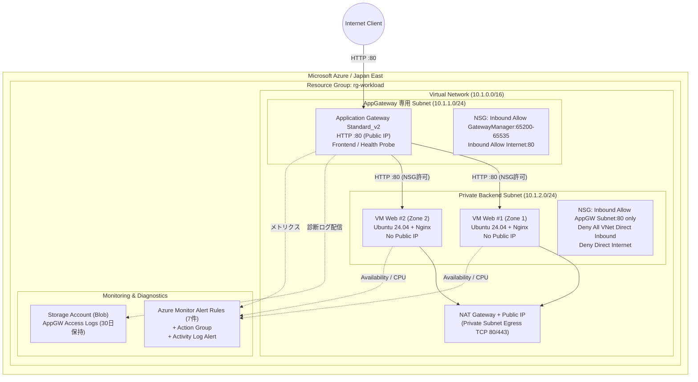

# Azureアーキテクチャ

## 構成図

## 通信ルールとセキュリティ境界

### Network Security Group (NSG) ルールマトリクス

| 対象 Subnet / NIC | 方向 | 優先度 | 送信元 | 宛先 / ポート | アクション | 用途 / 備考 |
|---|---|---:|---|---|---|---|
| **AppGateway Subnet** | Inbound | 100 | `Internet` | Any / TCP 80 | **Allow** | 一般ユーザーからのWebアクセス |
| **AppGateway Subnet** | Inbound | 110 | `GatewayManager` | Any / TCP 65200-65535 | **Allow** | Azure Application Gateway 制御ポート |
| **AppGateway Subnet** | Inbound | 120 | `AzureLoadBalancer` | Any / Any | **Allow** | Azure インフラヘルスプローブ |
| **Private Backend Subnet** | Inbound | 100 | `10.1.1.0/24` (AppGW Subnet) | Any / TCP 80 | **Allow** | Application Gatewayからの転送のみ許可 |
| **Private Backend Subnet** | Inbound | 200 | `VirtualNetwork` | Any / Any | **Deny** | Azure既定のVNet内全通ルールを明示的に遮断 |
| **Private Backend Subnet** | Inbound | 300 | `Internet` | Any / Any | **Deny** | インターネットからの直接到達を遮断 |
| **Private Backend Subnet** | Egress | 100 | Any | `Internet` / TCP 80, 443 | **Allow** (NATGW経由) | apt パッケージ更新・Nginxインストール用 |

### サブネット設計とルーティング

| サブネット名 | CIDR | 関連付けリソース | 外部アウトバウンド方式 |
|---|---|---|---|
| **`snet-appgw`** | `10.1.1.0/24` | Application Gateway Standard_v2 | 専用Public IP（受信およびプローブ） |
| **`snet-backend`** | `10.1.2.0/24` | Backend Linux VMs (Zone 1, Zone 2) | NAT Gateway + Public IP (明示的Egress) |

## Azure固有の判断

- **専用Subnet要件**: Application Gateway Standard_v2は、他のVMやリソースと同居できない専用Subnet（`/24`推奨）を要求するため、`snet-appgw`を独立して確保。
- **明示的NAT Gatewayの配置**: 2026年以降のAzure Private Subnetでは暗黙のDefault Outbound Accessが非推奨・制限されるため、NAT Gatewayを明示的に関連付けてパッケージ取得経路（apt/HTTP）を確立。
- **既定VNet許可の上書き**: Azure NSGのデフォルトルール（`AllowVnetInBound`）はVNet内の全通信を許可してしまうため、優先度200で明示的Denyルールを追加し、AppGateway Subnet以外からの通信を徹底して遮断。
- **完全SSHレス・パスワードレス運用**: VMへのPublic IP付与およびSSHポート開放を行わず、cloud-initスクリプトによるNginxの自動構築のみで完結。
- **低コストな診断ログ保存**: Log Analytics ワークスペースの取り込み課金とプロバイダー有効化の複雑性を避け、標準Storage AccountへのBlobアーカイブ（ライフサイクル30日）を採用。
