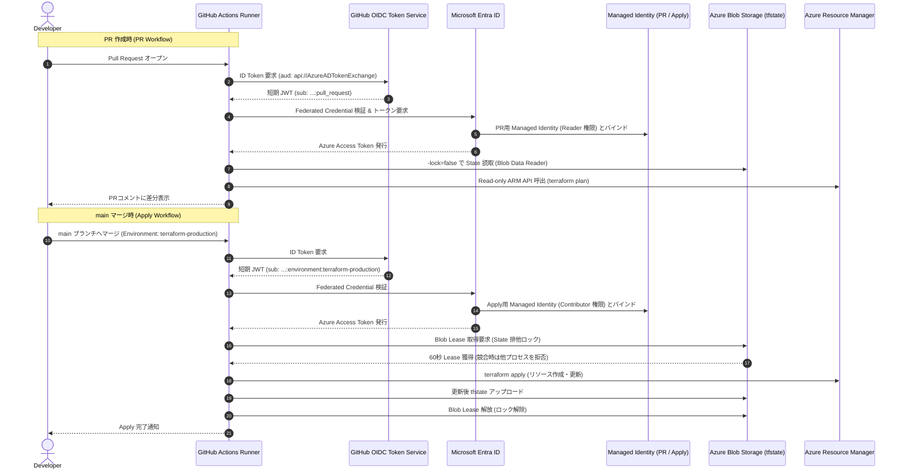

# CI/CD・OIDC・Remote State

## 採用設計

- Backend: Azure Blob Storage
- Authentication: Microsoft Entra ID
- State locking: Blob lease
- Recovery: Blob Versioning、Blob / Container Soft Delete
- Storage Key / SAS / Client Secret: 不使用
- PR Identity: 対象Resource Group Reader + State Blob Data Reader
- apply Identity: 対象Resource Group Contributor + State Blob Data Contributor
- Federation subjects: 同一repositoryの`pull_request`と`terraform-production` Environmentに限定

GitHub-hosted runnerを維持するためStorage public network endpointは到達可能とするが、匿名public access、Shared Key認証、container public accessは禁止する。

## OIDC認証・Blob Lease排他制御フロー

## Bootstrap実装結果

専用Resource Group内に次をTerraformで作成した。

- Standard LRS Storage Account
- private Blob Container
- Blob Versioning
- Blob / Container Soft Delete（7日）
- User Assigned Managed Identity（PR用・apply用）
- GitHub Actions用Federated Identity Credential（PR用・Environment用）
- workload Resource GroupおよびState Containerに限定したRBAC
- State移行者向けの一時的な`Storage Blob Data Contributor`

bootstrap planは12追加、0変更、0削除、置換0で、apply後のplanは`No changes`だった。StorageはHTTPS限定、TLS 1.2以上、匿名Blob access禁止、Shared Key禁止、Microsoft Entra認証を既定とした。FederationのissuerはGitHub Actions、audienceは`api://AzureADTokenExchange`、subjectは対象repositoryのPRと保護Environmentに限定した。

## Local State移行

1. 移行先Containerが空であることをMicrosoft Entra認証で確認した。
2. Local StateをGit管理対象外の`.state-backups/`へ複製した。
3. 元StateとバックアップのサイズおよびSHA-256が一致することを確認した。
4. backendを`azurerm`、`use_azuread_auth = true`として設定した。ローカルではAzure CLIユーザー認証を利用した。
5. State Keyを`terraform/azure-validation.tfstate`に固定した。
6. `terraform init -migrate-state -force-copy`でBlobへ移行した。
7. 指定KeyにState Objectが1件存在することをMicrosoft Entra認証で確認した。
8. 移行後のroot planが`No changes`であることを確認した。

Subscription ID、Tenant ID、Storage Account名、Client IDなどの実環境値は公開文書へ記載しない。backend固有値もGit管理対象外とし、CIではGitHub Variablesから与える。

## State locking実動作確認

Azure Blob leaseを60秒だけ手動取得した状態でroot planを実行し、TerraformがState lock取得エラーで同時処理を拒否することを確認した。leaseを確実に解放した後、root planが再び成功して`No changes`となった。AWS編のS3 native lockfileとは異なり、AzureRM BackendはState Blob自体のleaseを排他制御に利用する。

## 使用した権限

- 移行時: State Container scopeの`Storage Blob Data Contributor`のみ
- PR Identity: workload Resource Groupの`Reader`、State Containerの`Storage Blob Data Reader`
- apply Identity: workload Resource Groupの`Contributor`、State Containerの`Storage Blob Data Contributor`
- Storage Account Key、SAS、Client Secret: 不使用

State移行時の一時RBACはCI/CD実動作確認後、cleanup対象として削除する。

## 人間介入とAI自律実行

- 人間介入: 使用Subscriptionの指定、public network endpointを利用する低コストState設計の承認、GitHub設定変更とAzure識別子を暗号化Secretsとして登録する承認、GitHub Mobileによる本人確認
- AI自律実行: bootstrap設計・実装、plan/apply、Storage security検証、Federation設定検証、Local Stateバックアップ、State移行、Blob lease試験、移行前後の整合性確認、GitHub repository・Environment・Secrets・Variables・workflowの設定

## GitHub Actions設計

### Pull Request

- `static-checks`はAzure認証なし、`contents: read`だけで`fmt -check`、backend無効の`init`、`validate`を実行する。
- `plan`は同一repository由来PRに限り実行し、job単位で`id-token: write`と`contents: read`を許可する。
- PR用Managed Identityはworkload Resource GroupのReaderとState ContainerのBlob Data Readerだけを持つ。
- 読み取り専用Identityのためplanは`-lock=false`とし、State Blobへの書込みを許可しない。
- fork PRではAzure loginとcloud planを実行しない。
- PRからapplyするstepは存在しない。

### main apply

- mainへのpushだけで起動する。
- `terraform-production` GitHub Environmentを使用し、deploy元をmainだけに限定する。
- apply用Managed IdentityでOIDC認証し、保存したplanファイルだけをapplyする。
- GitHubでは`ARM_USE_OIDC=true`を用い、Remote StateとAzureRM ProviderをFederated Credentialで認証する。
- workflow concurrencyを1本に限定し、Azure Blob leaseと併用して同時更新を防ぐ。

### GitHub上の設定名

暗号化Secrets:

- `AZURE_SUBSCRIPTION_ID`
- `AZURE_TENANT_ID`
- `AZURE_PR_CLIENT_ID`
- `AZURE_APPLY_CLIENT_ID`（`terraform-production` Environment）

Variables:

- `TF_STATE_STORAGE_ACCOUNT`
- `TF_STATE_RESOURCE_GROUP`
- `TF_STATE_CONTAINER`
- `SSH_PUBLIC_KEY`

Client Secret、Storage Account Key、SAS、SSH秘密鍵は登録しない。

## GitHub Actions実行結果（途中経過）

- GitHub OIDC token取得: 成功
- Entra Federated IdentityによるAzure login: 成功
- Azure Blob Remote State初期化: 成功
- `terraform validate`: 成功
- main apply workflow: workflowとしては成功
- 長期Credential / Client Secret / Storage Key / SAS: 不使用

ただし初回成功runでは、ローカルだけに存在した追加タグ入力がCIへ渡らず、12リソースの`Purpose`タグがin-placeで削除された。削除・置換・ネットワーク・Identity・Monitoringの変更はなかった。

再発防止として、公開可能な`Purpose`値をTerraform変数の既定値へ移し、ローカル実行とGitHub Actionsで同じ入力値を使うようにした。修復planが12件のin-place tag更新だけであることを機械的に確認し、人間の承認後に適用した。修復後のローカル`terraform plan`は`No changes`となった。

- 人間介入: 12件のタグ修復applyを承認
- AI自律実行: CIログ解析、原因特定、入力値共通化、planの変更範囲検査、apply、適用後plan確認

修復内容をmainへ反映した後のGitHub Actionsでは、GitHub OIDCによるAzure login、Azure Blob Remote State初期化、Blob leaseによるstate lock、validate、plan、保存済みplanのapplyがすべて成功した。CIのplanは`No changes`、apply結果は0追加・0変更・0削除であり、ローカル実行とCI実行の入力値および実環境が一致したことを確認した。

## Cleanup再作成防止

cleanup完了後の文書更新でmain workflowが環境を再作成しないよう、cloud plan/apply jobへRepository Variable `AZURE_ENVIRONMENT_ACTIVE == 'true'`の条件を追加した。PRの静的fmt/init/validateは継続する。環境を再構築する場合だけVariableを明示的に`true`へ設定する。

GitHub専用Secrets、Variables、`terraform-production` EnvironmentはAzure cleanup完了後の削除候補として扱う。自動削除は行わない。

## Remote State / bootstrap cleanup結果

- cleanup前root plan: `No changes`
- cleanup前bootstrap plan: State内の実測OIDC subjectをメモリ上の一時入力として使用し`No changes`
- State backup: Remote root stateとbootstrap local stateをGit管理対象外へ保存し、SHA-256を確認
- root destroy: 41件削除、State 0件とworkload Resource GroupのNot Foundを確認
- bootstrap destroy: 12件削除
- Remote State Storage / Container: 削除
- Managed Identity: 2件削除
- Federated Identity Credential: 2件削除
- Role Assignment: 5件削除、削除Identityに対する残存0
- State Resource Group: Not Found

root削除後、Remote State Blobが削除済みrootを表す最終Stateへ更新されたことを確認してからbootstrapを削除した。State Storage削除後にroot planを再実行することはbackend消失によりできないため、直前のState 0件とAzure Resource GroupのNot Foundを最終整合性証跡とした。

## GitHub cleanup候補

GitHub設定画面で次の名称が存在することを確認した。実値は取得・記録していない。再利用予定がなければ削除できるが、本検証ではユーザー要件に従い削除していない。

- Repository Secrets: `AZURE_SUBSCRIPTION_ID`、`AZURE_TENANT_ID`、`AZURE_PR_CLIENT_ID`
- Environment Secret: `AZURE_APPLY_CLIENT_ID`
- Repository Variables: `TF_STATE_STORAGE_ACCOUNT`、`TF_STATE_RESOURCE_GROUP`、`TF_STATE_CONTAINER`、`SSH_PUBLIC_KEY`
- Environment: `terraform-production`（main限定）

`AZURE_ENVIRONMENT_ACTIVE`は設定されておらず、cloud plan/apply jobは停止状態である。Static PR checksは継続する。
