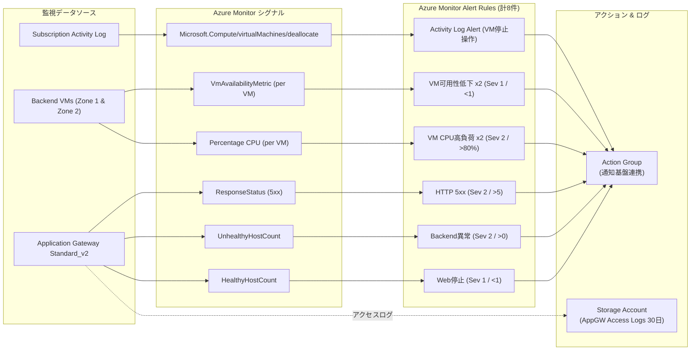
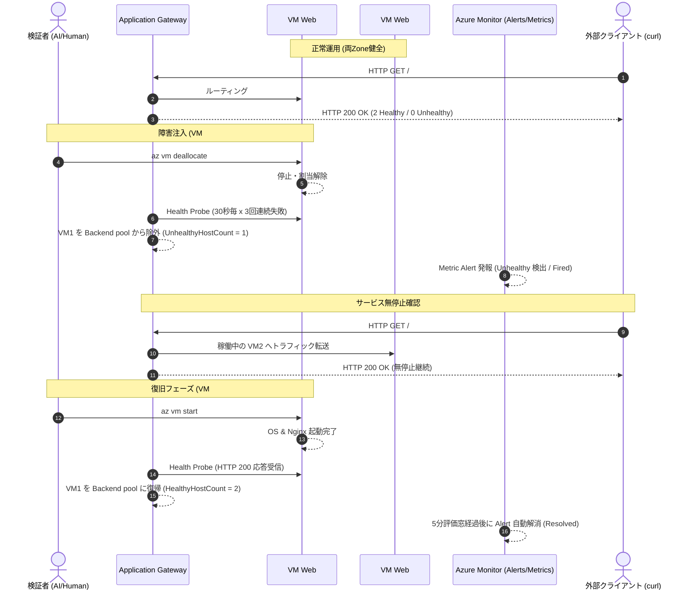

# Monitoring

## 設計

既存のApplication GatewayとVMが自動提供するAzure Monitorプラットフォームメトリクスを主に使用する。詳細VM監視エージェント、VM Insights、Application Insights、NATやネットワーク構成の追加は行わない。

Application Gatewayのアクセスログだけを専用のStandard LRS Storage Accountへ保存する。保存先は匿名公開を禁止し、Storage firewallでAzure trusted services以外を拒否する。診断設定の保存期間指定は廃止済みのため、Storage lifecycle policyで30日後に削除する。

Log Analyticsは今回不採用とした。対象Subscriptionでは必要なResource Providerが未登録であり、短期検証のためにサブスクリプション全体の設定変更とログ取り込み課金を追加しないためである。

## 監視項目

| 対象 | シグナル | 条件 | 期間 | 重大度 |
|---|---|---:|---:|---:|
| Web停止 | `HealthyHostCount` | 1未満 | 5分 | 1 |
| Backend異常 | `UnhealthyHostCount` | 0超 | 5分 | 2 |
| HTTP 5xx | `ResponseStatus` / `5xx` | 5件超 | 5分 | 2 |
| VM CPU | `Percentage CPU` | 平均80%超 | 5分 | 2 |
| VM可用性 | `VmAvailabilityMetric` | 平均1未満 | 5分 | 1 |
| 明示的VM停止 | Activity Logのdeallocate操作 | 操作発生 | イベント | - |

Action GroupはすべてのAlert Ruleへ接続する。通知Receiverは個人情報をリポジトリへ入れないため未設定で、Fired / Resolved状態はAzure Monitorで確認する。実運用では組織管理の通知先を別途追加する。

Azure Portal/CLIから標準メトリクス、Alert history、Activity Logを確認できる。Application Gatewayアクセスログは専用Storageへ保存される。Nginx guest log収集は、Azure Monitor AgentとData Collection Ruleの運用負荷・通信・ログ量を避けるため今回の最小構成には含めない。

## コスト

標準プラットフォームメトリクス自体は追加収集設定を必要としない。課金対象は主にMetric Alertの時系列評価、Action Group通知を追加した場合の通知、少量のStorage容量・トランザクションである。短期・低トラフィック検証では既存Application Gateway費用に比べ小さい想定だが、正確な額は実際のログ量とAzure Monitorの地域別料金による。

## AWS編との主な違い

- CloudWatch AlarmではなくAzure Monitor Metric AlertとAction Groupを使う。
- VM停止・状態異常にはAzure固有の`VmAvailabilityMetric`とActivity Logを組み合わせる。
- Application GatewayのBackend healthは`HealthyHostCount` / `UnhealthyHostCount`で監視する。
- CloudWatch Logs相当の検索基盤は追加せず、低コストなStorage archiveを選択した。
- AzureでCLI/PortalからVMを停止するとAvailability Metricが欠損する場合があるため、明示的なdeallocate操作もActivity Logで補完する。

## 公式資料

- [Monitor Azure Application Gateway](https://learn.microsoft.com/azure/application-gateway/monitor-application-gateway)
- [Monitoring data reference for Azure Virtual Machines](https://learn.microsoft.com/azure/virtual-machines/monitor-vm-reference)
- [Diagnostic settings in Azure Monitor](https://learn.microsoft.com/azure/azure-monitor/platform/diagnostic-settings)
- [Azure Monitor cost and usage](https://learn.microsoft.com/azure/azure-monitor/fundamentals/cost-usage)

## 実装・検証結果

- `terraform fmt -check -recursive`: 成功
- `terraform validate`: 成功
- ローカルplan: 12追加・0変更・0削除
- plan検査: 既存リソースのupdate / replace / destroyなし
- 追加内訳: Action Group 1、Metric Alert 7、Activity Log Alert 1、Diagnostic Setting 1、ログStorage 1、Lifecycle Policy 1
- PR workflow: fmt / init / validate / GitHub OIDC / Remote State / planが成功
- PR plan: 12追加・0変更・0削除、PRからapplyなし
- main apply workflow: GitHub OIDCで12追加・0変更・0削除
- apply後のローカルplan: `No changes`

## 障害試験

2台のBackend VMのうち1台だけをdeallocateし、もう1台は稼働状態を維持した。

| 確認項目 | 結果 |
|---|---|
| 停止前 | HTTP 200、Backend 2 Healthy / 0 Unhealthy |
| 1台停止後 | HTTP 200、Backend 1 Healthy / 1 Unhealthy |
| 停止操作 | Azure Activity Logへ記録 |
| Metric Alert | HealthyからUnhealthy（Fired相当）へ遷移 |
| VM再起動後 | HTTP 200、Backend 2 Healthy / 0 Unhealthy |
| 復旧後メトリクス | `UnhealthyHostCount`が0へ復帰 |
| Alert自動解消 | UnhealthyからHealthy（Resolved相当）へ遷移 |

Health Probeは30秒間隔・3回失敗でBackend異常を判定する。Metric Alertは1分間隔・5分窓で評価するため、Backend healthの変化よりFired/Resolved表示が遅れるAzure固有の挙動を確認した。

## 人間介入とAI自律判断

- 人間介入: 監視追加と安全な障害試験を含む検証要件の提示
- AI自律判断: Log Analyticsを不採用とし、専用Storage archiveを選択
- AI自律実行: Terraform実装、静的検証、plan安全性検査、PR作成、CI確認、merge、apply監視、1台停止試験、復旧、Alert状態確認
- 権限拡張: なし

## 発生した問題

- Windows上でAzure CLIのJMESPath式がコマンドシェルに解釈され、事前確認コマンドが失敗した。Azure側の変更は発生していない。JSONを取得してPowerShell側で絞り込む方式へ変更し、正常に確認できた。
- Metric Alert作成には約2分、障害発生・復旧の状態反映には評価窓と追加の反映遅延があった。エラーではなくAzure Monitorの評価周期による挙動である。

## Cleanup

Diagnostic Setting、Metric Alert 7件、Activity Log Alert、Action Group、Monitoring用StorageとLifecycle Policyはroot Terraform destroyで削除した。cleanup後、検証用workload Resource Groupおよび検証タグ付き監視リソースが0であることをAzureから読み取り確認した。
